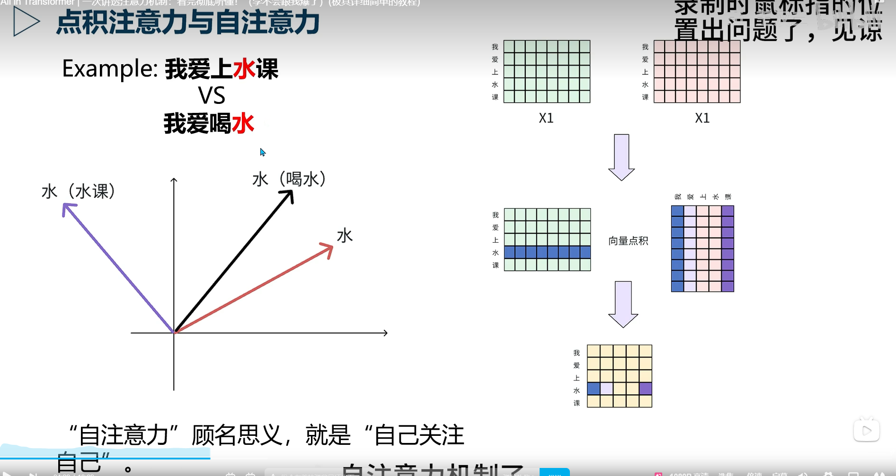
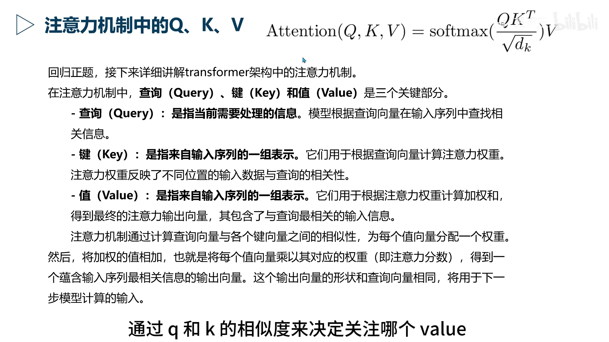

B站：https://www.bilibili.com/video/BV16f1mB7Ebj?spm_id_from=333.788.recommend_more_video.-1&trackid=web_related_0.router-related-2479604-tdxs9.1778072366158.576&vd_source=33ad1d6fcb88f6cd97cba3aca8c0ef5b

对于自注意力的qkv的理解
就是qk矩阵相乘用来发现哪些token与问题最相关，就能得到哪一个v对应的权重比较高，最后的答案或者结果v矩阵与对应权重相乘的结果，权重高的他的value在最终的结果中占比就比较大，权重低的占比就比较小。权重其实是在 QK 之后、和 V 相乘之前就已经算出来了，最后与 V 相乘是用这些权重去加权融合 Value 信息。

编码器：注意力机制--自注意力--qkv矩阵--多头注意力--残差化--归一化 * 6  作为K和V

解码器：掩码层（附加正确结果训练）作为 Q
