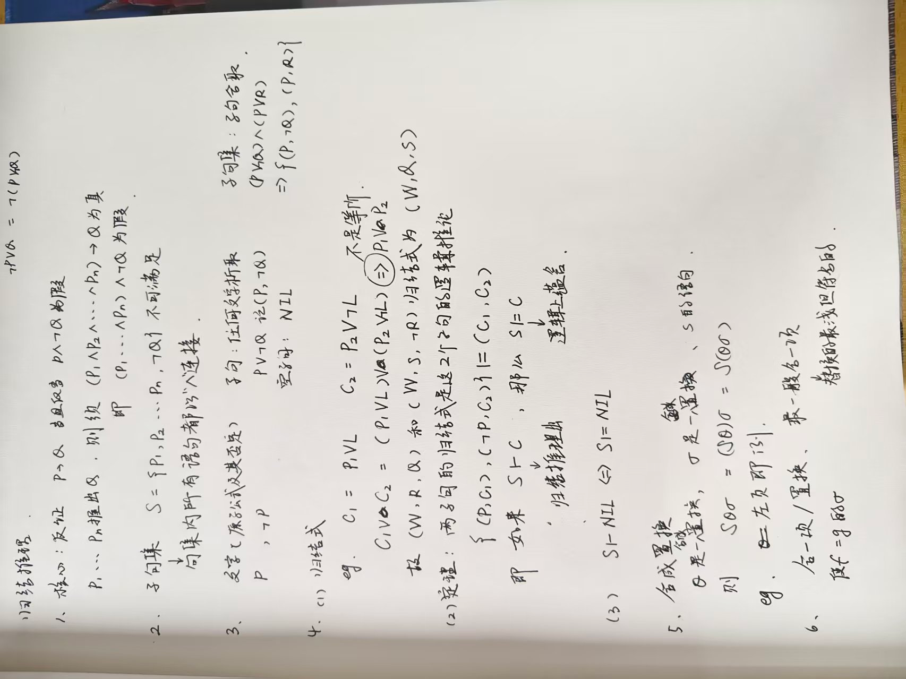
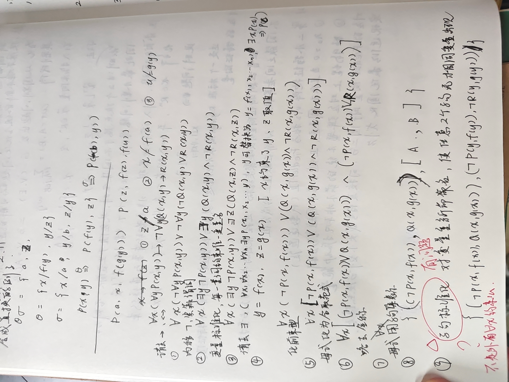
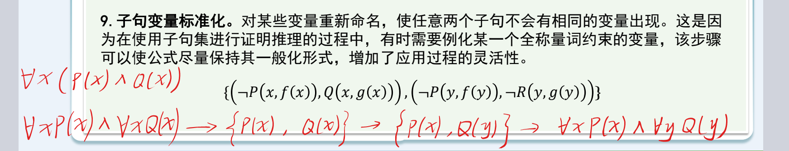
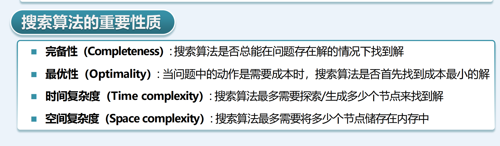
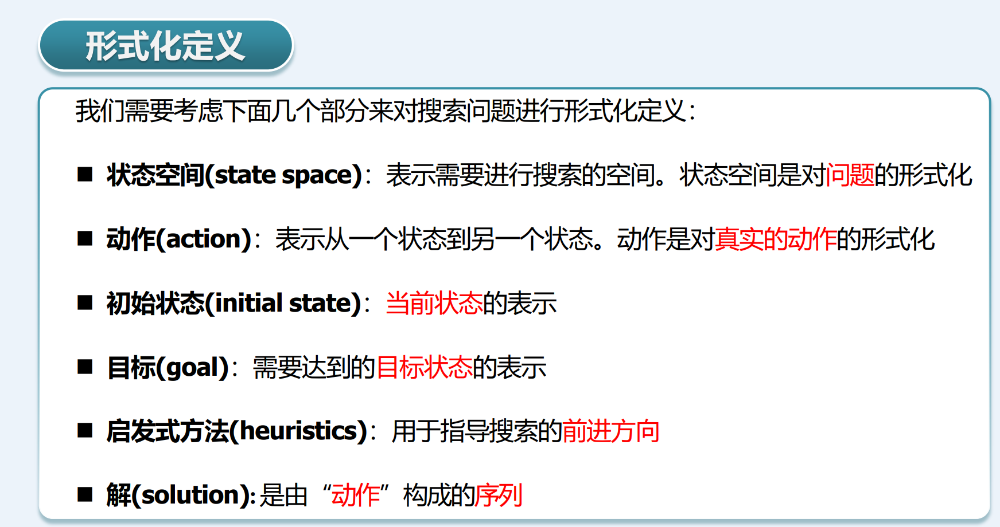
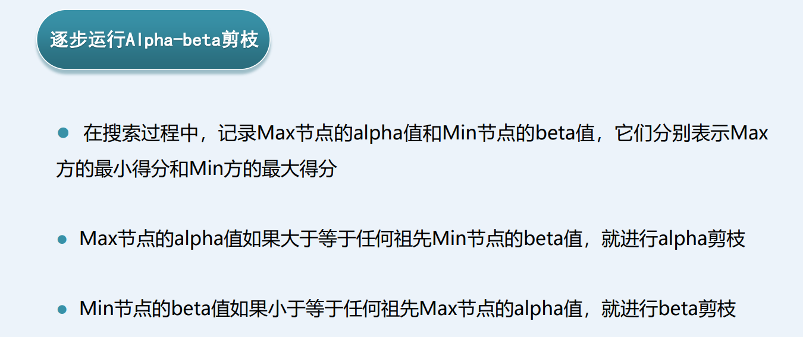

# 第一讲：绪论

## 1.1人工智能的三大学派

**(1)符号主义**

认为人工智能来源于数理逻辑，人类的认知过程本质上是对符号的运算过程（即“物理符号系统假设”），智能可以通过对符号的表示、存储、检索和推理来实现。

主要方法：知识表示、逻辑推理、专家系统。

优点：逻辑严密，可解释性强，推理过程透明，适合处理逻辑性强、规则明确的问题（如数学证明、棋类博弈早期版本）。
缺点：难以处理模糊、不确定的信息；知识获取困难（“知识瓶颈”）；缺乏自学习能力，难以模拟人类的直觉和感知。

**(2) 连接主义**

认为人工智能源于仿生学，特别是对人脑神经元结构和工作机制的模拟，智能产生于大量简单单元（神经元）之间的并行连接和相互作用，强调“学习”的过程，通过调整连接权重来适应环境。

主要方法：神经网络、深度学习、反向传播。

优点：具有强大的自学习能力、容错性和泛化能力；擅长处理图像识别、语音识别、自然语言处理等感知类和非线性问题。
缺点：模型通常是“黑盒”，可解释性差（难以解释为什么得出某个结论）；需要海量数据和巨大的计算资源；训练过程复杂。

**(3) 行为主义**

认为人工智能源于控制论和生物进化论，智能取决于感知和行动，是在与环境的交互中表现出来的（“感知-动作”模式），不需要复杂的内部表示或推理，智能是适应环境的结果。

主要方法：强化学习、遗传算法。

优点：强调实时性和适应性，适合动态环境下的决策和控制；不需要预先定义所有规则，通过与环境试错来优化策略。
缺点：训练周期长，探索成本高；在复杂任务中可能难以收敛到最优解。

# 第二讲：知识的表示和推理

人工智能的本质是知识的表示，人工智能是否成功取决于它所蕴含的知识表示是否清楚。

这一讲主要介绍了知识表示和推理的基本概念和方法。

## 2.1 知识表示

略

## 2.2 命题逻辑

### 2.2.1 命题演算形式系统

命题演算（又称命题逻辑）是数理逻辑的基础系统，研究的是复合命题与其组成部分之间的逻辑关系，而不涉及命题内部的结构；形式系统是一个符号体系，包含以下四个组成部分。

| 要素               | 说明                                 |
| ------------------ | ------------------------------------ |
| **字母表**   | 符号集合（命题变元、联结词、括号等） |
| **形成规则** | 如何构造合法的公式（合式公式）       |
| **公理**     | 系统中被承认为真的基本公式           |
| **推理规则** | 从已知公式推导出新公式的方法         |

### 2.2.2 证明与演绎

需要注意**证明**与**演绎**的区别。

* 证明：从公理出发，通过推理规则得到定理的有限公式序列，记作
* 推理：从假设/前提集出发，通过推理规则得出结论的过程，记作

### 2.2.3 希尔伯特演绎系统

三个公理：


## 2.3 一阶谓词逻辑

略

### 2.3.1 变量置换

置换是形如 {  } 的有限集合。

其中 {  } 是互不相同的变量，{  } 是项（常量、变量或函数）。

 表示将  替换为 ，前提是  中不含有 ，且不能出现循环置换。

> 变量的置换是可以复合的，且具有 **结合性** ，但不具有交换律。

## 2.4 逻辑推理

**逻辑推理**指的是用蕴涵推导出结论。
**模型验证**则是通过枚举所有可能的模型来验证在当前给定的知识库的前提下，结论都为真。

逻辑推理方法：演绎推理、归纳推理、溯因推理等。
这里主要关注演绎推理，包括自然演绎推理和归结推理。自然演绎推理已经在离散数学课程中学习过，这里主要介绍 **归结推理** 。

### 2.4.1 归结推理

归结推理是一种自动化的定理证明方法，核心思想是通过归结规则消去互补文字来推导矛盾。

概念：


### 2.4.2 命题逻辑的归结推理

推理步骤：
 **(1) 转化** ：将所有前提和“结论的否定”转化为 **合取范式 (CNF)** ，得到子句集。
 **(2) 归结** ：不断对子句集中的子句应用归结规则，生成新子句并加入集合。
 **(3) 终止** ：若推导出 **空子句** （表示矛盾），则证明原命题成立；若无法再生成新子句且未出现空子句，则原命题不成立。

### 2.4.3 谓词逻辑的归结推理

谓词逻辑的归结推理步骤：转化、合一、归结、终止。
可以看到，谓词逻辑的归结推理与命题逻辑类似，但需要考虑 **合一** ，同时第一步**转化**也会更加复杂一些。


## **归结推理的核心步骤和逻辑：**

---

### 1. 预处理：化为子句集

**在进行归结之前，必须将所有的逻辑表达式转换成 子句集（Clause Set） 。这通常涉及以下步骤：**

* **消去蕴涵符号 （如 $A \to B$ 变为 $\neg A \vee B$）。**
* **标准化变量 ：确保每个量词控制的变量名唯一。**
* **消去存在量词（Skolem化） ：用常量或 Skolem 函数替换存在量词。**
* **化为前束范式 ：将所有全称量词移到公式最左边。**
* **消去全称量词 ：默认所有变量都是全称泛指的。**
* **化为合取范式（CNF） ：最终得到一系列由析取（或）连接的文字组成的“子句”。**

### 2. 置换与合一（Unification）

**这是谓词逻辑归结与命题逻辑归结最大的区别。由于谓词中含有变量，我们需要找到一个 最一般置换（MGU） ，使得两个看似不同的谓词变得相同。**

> **例子：**
>
> * **子句 $C_1: P(x) \vee Q(a)$**
> * **子句 $C_2: \neg P(b) \vee R(y)$**
>
> **为了归结 $P(x)$ 和 $\neg P(b)$，我们需要令置换 $\sigma = \{b/x\}$。这样 $P(x)$ 变成了 $P(b)$，从而可以抵消。**

### 3. 归结规则

**给定两个子句 $C_1$ 和 $C_2$，如果 $C_1$ 中有一个文字 $L_1$，而 $C_2$ 中有一个文字 $L_2$，且 $L_1$ 与 $\neg L_2$ 是 可合一的 （存在置换 $\sigma$ 使得 $L_1\sigma = \neg L_2\sigma$），那么可以从这两个子句推导出 归结式（Resolvent） ：**

$$
Res(C_1, C_2) = (C_1\sigma - \{L_1\sigma\}) \cup (C_2\sigma - \{L_2\sigma\})
$$

### 4. 证明过程：反证法

**归结证明的具体流程如下：**

1. **将已知条件（公理）全部化为子句，组成子句集 $S$。**
2. **将要证明的结论取反，化为子句后加入 $S$。**
3. **不断从 $S$ 中选择两个可以归结的子句，计算其归结式。**
4. **将新的归结式加入 $S$。**
5. **目标 ：如果推导出了 空子句（$\square$** 或 NIL）** ，说明原公式集中存在矛盾，从而证明了原结论成立。**

---

### 归结推理示例

**假设我们要证明“苏格拉底会死”：**

* **已知 1 ：所有人都会死。 $\forall x (Man(x) \to Mortal(x))$**
* **已知 2 ：苏格拉底是人。 $Man(Socrates)$**
* **结论 ：苏格拉底会死。 $Mortal(Socrates)$**

**步骤：**

1. **子句集化 ：**

* **$C_1: \neg Man(x) \vee Mortal(x)$**
* **$C_2: Man(Socrates)$**

1. **结论取反 ：**

* **$C_3: \neg Mortal(Socrates)$**

1. **归结 ：**

* **$C_1$ 与 $C_2$ 归结（置换 $\{Socrates/x\}$）：得到 $C_4: Mortal(Socrates)$**
* **$C_4$ 与 $C_3$ 归结：得到 $\square$（矛盾）**

1. **结论 ：证明成功。**

---

### 归结推理的策略

**由于子句集可能会产生爆炸式的组合，通常会采用一些策略来提高搜索效率：**

* **删除策略 ：删除包含纯文字或重言式（如 $P \vee \neg P$）的子句。**
* **支持集策略（Set of Support） ：要求每次归结至少有一个子句是由目标结论演变而来的。**
* **线性归结 ：每次归结都使用上一步产生的归结式与原始子句集中的子句进行。**

## 如何理解最一般合一项

好的，以下是为你提供的完整复述内容，严格保持原意且 **标题不超过三级** ：

---

### 1. 什么是“合一” (Unification)？

“合一”简单来说就是  **找相同** 。给定两个包含变量的逻辑表达式（项） **$s$** 和  **$t$** ，如果能找到一个代换  **$\sigma$** （即把变量替换成某些项的规则），使得应用代换后两个表达式完全一样，即：

$$
s\sigma = t\sigma
$$

那么这个 **$\sigma$** 就被称为  **合一项 (Unifier)** 。

**例子：**

* 项 1：**$f(x, g(y))$**
* 项 2：**$f(A, z)$**
* 如果我们令  **$\sigma = \{x/A, z/g(y)\}$** ，那么两边都变成了  **$f(A, g(y))$** 。所以 **$\sigma$** 是一个合一项。

---

### 2. 为什么要加“最一般” (Most General)？

对于同一组表达式，合一项往往不止一个。有些合一项会引入“多余”的限制，而 **MGU** 则是那个**限制最少、最具有代表性**的合一项。

**核心定义：**

如果 **$\sigma$** 是一个 MGU，那么对于任何其他的合一项  **$\sigma'$** ，都存在一个代换  **$\delta$** ，使得：

$$
\sigma' = \sigma \circ \delta
$$

这意味着， **任何其他的合一项都可以通过在 MGU 的基础上进一步代换得到** 。MGU 处于代换“树”的根部，保留了最大的灵活性。

---

### 3. 直观理解：不要过度约束

想象你在为一个团队设计制服：

* **要求 1** ：小明的上衣颜色要和小红一样。
* **要求 2** ：小红的裤子要是蓝色的。

**方案 A (MGU)：**

让小明的上衣和小红的一样（变量绑定），且裤子全是蓝色。至于上衣具体是什么颜色（红色？白色？）， **先不决定** ，留给以后。这就是“最一般”的。

**方案 B (普通合一项)：**

强制要求小明和小红都穿“红上衣+蓝裤子”。虽然满足了要求，但它增加了“红色”这个多余的限制。万一以后要求制服必须是绿色的，方案 B 就废了，而方案 A 还能用。

---

### 4. 算法视角：如何找到 MGU？

寻找 MGU 的过程本质上是一个**递归消元**的过程。常用的 Robinson 算法步骤如下：

1. **从左向右扫描** ：对比两个项，找到第一个不一致的地方。
2. **检查变量** ：

* 如果不一致的地方其中一个是变量  **$x$** ，另一个是项  **$t$** 。
* **Occurrence Check (出现检查)** ：确认 **$x$** 是否出现在 **$t$** 中。如果没出现，就把 **$x$** 替换为  **$t$** ，并对全文应用这个代换。

1. **重复** ：直到两个项完全相同。

---

### 5. 为什么它很重要？

在计算机科学中，MGU 几乎无处不在：

* **Prolog 语言** ：执行查询的核心机制就是合一。
* **类型推导 (Type Inference)** ：像 Haskell 或 C++ 模板推导，编译器通过 MGU 确定函数参数的最精确类型。
* **归结原理 (Resolution)** ：在自动证明题中，通过 MGU 将两个子句中的矛盾项对消。

**总结：**

**合一项**让两个式子相等，而**最一般合一项**在让它们相等的同时， **尽量不给变量赋值具体的实义内容** ，从而保证了这个解可以被应用到更广泛的场景中。







# 第三讲：搜索算法



重点是最优性，最优不是你用时最短找到的路径，而是你能否找到最短路径

以下为REVIEW：

搜索问题的形式化定义：



## 基本概述


### **搜索技术知识框架概述**

基于您提供的《人工智能：搜索技术》课件，这是一个关于人工智能搜索算法的完整知识体系，涵盖了从基础概念到高级应用的多个层次。以下是整个课件的知识框架概述：

#### **一、 搜索问题基础与形式化**

这一部分建立了搜索问题的理论基础，明确了问题的构成要素和分析方法。

- **搜索的定义与动机**：搜索被定义为一种计算智能体决策的方法，通过回答“我在哪？”（当前状态）、“我能干什么？”（可用动作）和“我要去哪？”（目标状态）三个核心问题，来规划一系列动作以达到期望状态。它是解决许多没有特定算法问题的通用方法。
- **形式化定义**：一个搜索问题需要明确六个组成部分：
  1. **状态空间**：所有可能状态的集合。
  2. **动作**：导致状态间转换的操作。
  3. **初始状态**：搜索的起点。
  4. **目标**：需要达成的状态条件。
  5. **启发式方法**（可选）：指导搜索方向的领域知识。
  6. **解**：一个将初始状态转换为目标状态的动作序列。
- **经典示例**：课件以“罗马尼亚旅行问题”（寻找城市间最短路径）和“八数码问题”（滑块拼图）为例，具体说明了如何将实际问题形式化为搜索问题。

#### **二、 搜索算法通用性质与盲目搜索**

在介绍具体算法前，课件定义了评估算法的通用标准，并系统讲解了几种不利用问题领域知识的搜索策略。

- **算法评价标准**：
  - **完备性**：当问题有解时，算法是否能保证找到解。
  - **最优性**：算法是否能找到成本最低的解。
  - **时间复杂度**：搜索过程中需要生成的节点数量。
  - **空间复杂度**：搜索过程中需要存储在内存中的节点数量。
- **盲目（无信息）搜索算法**：这些算法按照固定规则扩展节点，不评估状态的优劣。
  - **宽度优先搜索**：逐层扩展，具有完备性和最优性，但时空复杂度高（$O(b^{d+1})$）。
  - **深度优先搜索**：沿单条路径深入，空间复杂度低（$O(bm)$），但在无限状态空间中不完备，也不保证最优。
  - **一致代价搜索**：按到达当前节点的路径成本扩展，是宽度优先搜索在加权图上的泛化。
  - **深度受限搜索**：为深度优先设置深度上限$L$，解决无限路径问题，但解路径长度不能超过$L$。
  - **迭代加深搜索**：结合深度优先的空间效率和宽度优先的完备最优性，逐渐增加深度限制进行多次搜索。

#### **三、 启发式搜索与A*算法**

这是课件的核心，介绍了如何利用问题领域的额外知识来引导搜索，显著提高效率。

- **启发式函数**：记为$h(n)$，用于估计从节点$n$到目标节点的最小成本。它依赖于具体问题领域，例如在八数码问题中，可以使用错位棋子数或曼哈顿距离作为启发值。
- **贪心最佳优先搜索**：仅根据启发函数$h(n)$选择节点，试图快速接近目标。它忽略了已付出的成本，因此既不完备也不最优。
- **A搜索算法**：综合已付出成本和启发估计，定义评价函数$f(n) = g(n) + h(n)$，其中$g(n)$是从起点到$n$的实际成本。总是扩展$f(n)$值最小的节点。
- **A*搜索算法**：在A搜索的基础上，要求启发函数$h(n)$满足**可采纳性**（即$h(n) \leq h^*(n)$，永不高于真实最优成本$h^*(n)$）。这保证了A*算法能找到最优解。
  - **一致性（单调性）**：更强的条件，要求$h(n) \leq c(n, n') + h(n')$。一致性蕴含可采纳性，并能保证在使用环检测（避免重复状态）时仍保持最优性。
  - **IDA***：迭代加深的A*算法，通过迭代提高$f(n)$的阈值而非深度来限制搜索，解决A*的空间复杂度问题。

#### **四、 启发式函数的构建方法：松弛问题**

为了设计出有效的可采纳启发函数，课件介绍了“松弛问题”这一系统化方法。

- **核心思想**：通过移除原问题中的某些约束，得到一个更简单、更容易求解的问题。原问题的最优解成本是松弛问题最优解成本的上限，因此松弛问题的解成本可以作为原问题的一个可采纳启发函数。
- **八数码问题示例**：
  - 松弛“目标位置必须为空”的条件，得到“错位棋子数”启发函数。
  - 松弛“棋子必须相邻移动”的条件，得到“曼哈顿距离”启发函数。
  - 曼哈顿距离启发函数比错位棋子数函数包含更多信息（“支配”关系），因此通常能引导A*搜索扩展更少的节点。

#### **五、 搜索技术应用实例**

课件通过几个经典问题展示了如何应用前述的搜索框架。

- **八数码问题**：详细演示了使用A*算法配合曼哈顿距离启发函数求解的过程。
- **积木规划问题**：定义了动作（移动积木到桌面或另一积木上），并设计了“不在目标位置的积木数”作为可采纳且单调的启发函数。
- **传教士与野蛮人渡河问题**：这是一个经典的约束满足和规划问题。课件形式化了状态$(M, C, B)$和动作$(m, c)$，并为$K \leq 3$的情况推导出了一个可采纳的启发函数：$h(n) = M + C - 2B$（其中$B=1$表示船在左岸）。

#### **六、 对抗搜索（博弈搜索）**

当环境中存在利益冲突的其他智能体时，搜索问题扩展为对抗搜索。

- **问题泛化**：从单智能体对环境的完全控制，转变为多智能体交替行动、零和博弈的场景。
- **MiniMax算法**：
  - 假设对手理性且最优，通过构建博弈树，为Max玩家选择最大化最小收益（为Min玩家选择最小化最大收益）的行动。
  - 通过递归计算节点的Minimax值（终端节点的效用值反向传播）来决定最优策略。
- **Alpha-Beta剪枝**：
  - 对MiniMax搜索树的优化技术，通过跟踪$\alpha$（Max节点当前最好值下界）和$\beta$（Min节点当前最好值上界），剪除不可能影响最终决策的分支，大幅减少需要评估的节点数。
- **资源限制与评价函数**：在复杂游戏（如国际象棋）中，无法搜索到终局，需要：
  1. **深度限制搜索**：设定搜索深度上限。
  2. **评价函数**：在非终端节点估计局势优劣，代替真实的效用值。评价函数通常为多个特征的加权线性组合（如棋子价值、棋盘控制度）。
- **蒙特卡洛树搜索**：一种基于随机模拟的搜索算法，特别适用于围棋等巨大分支因子的游戏。它通过**选择、扩展、模拟、反向传播**四个步骤，不断探索并更新搜索树中节点的胜率估计，从而指导决策。AlphaGo等现代AI成功融合了MCTS与深度神经网络。

---

这个知识框架从搜索的基本定义出发，历经盲目搜索、启发式搜索、最优搜索算法（A*），再到启发函数的设计方法论，最后扩展到多智能体对抗的博弈搜索，构成了人工智能中解决序列决策和规划问题的完整方法论体系。


## 区分：生成与拓展

还有区分：！！！！！！重点

扩展时测试

节点从边界弹出、准备扩展时才检查

### 两种目标测试时机：深入解析

这个区别看似微小，实际上深刻影响着算法的正确性和效率。让我从机制、原因、后果三个层面展开。

---

#### **先厘清两个概念：生成 vs 扩展**

在搜索过程中，每个节点有两个关键的生命节点：

- **生成（Generation）**：节点 $n$ 被它的父节点通过某个动作创造出来，此时我们知道了 $n$ 的状态是什么、到达 $n$ 的路径成本是多少。但 $n$ 还**没有被考察过**，它的后继还未知。
- **扩展（Expansion）**：节点 $n$ 从边界（Frontier）中被**弹出**，我们开始生成 $n$ 的所有后继节点。此时 $n$ 才真正被"处理"。

一个节点从生成到扩展之间，可能要在边界中排队等待很长时间。

---

#### **生成时测试**

**做法**：每当一个节点被生成出来，立刻检查它是否满足目标条件。如果是，直接返回该节点作为解，搜索结束。

**采用者**：BFS、DFS

**为什么 BFS 和 DFS 可以用生成时测试？**

关键在于：BFS 和 DFS 的搜索策略保证了**第一次生成某个状态时，到达该状态的路径就已经是最优的**（在各自的意义上）。

- **BFS**：按层扩展。第一次生成深度为 $d$ 的节点时，它一定来自深度为 $d-1$ 的某条最短路径。不存在"绕远路先生成"的可能，因为更长的路径要等到更深的层才会被探索。
- **DFS**：DFS 根本不关心最优性，它只关心"找到没"。生成时测试能让它尽早结束，符合 DFS "一条路走到黑、撞到目标就停"的策略。

**具体例子——BFS 生成时测试**：

```
        S
       / \
      A   B
     / \   \
    C   G   D
        |
        G
```

BFS 按层扩展：先扩展 S，生成 A 和 B（都不是目标）。再扩展 A，生成 C 和 G。**G 在生成时立刻被检测到**，搜索结束，返回路径 S→A→G（深度 2）。

注意：B 下面还有一个 G（深度 2），但 BFS 不需要等到扩展 B 才发现它——A 下面的 G 先生成，先生成先检测，而且两者深度相同，都是最优。

**生成时测试的好处**：快。不需要把目标节点放入边界、排队等待、再弹出来，省了一步。

---

#### **扩展时测试**

**做法**：节点生成时**不检查**是否为目标，直接放入边界。只有当节点从边界中**弹出**、轮到它被扩展时，才检查是否为目标。

**采用者**：UCS、A*

**为什么 UCS 和 A\* 必须用扩展时测试？**

因为同一个状态可能通过**多条不同成本的路径**多次生成。第一次生成时的路径成本，未必是到达该状态的最优成本。

**具体例子——UCS 扩展时测试**：

```
        S
      /   \
  (5)/     \(2)
    /       \
   A         B
   |         |
(1)|     (10)|
   |         |
   G         G
```

UCS 按 $g(n)$ 升序排列边界：

**第 1 步**：边界 = {S:0}，弹出 S，扩展 S，生成 A（$g=5$）和 B（$g=2$）。两者都不是目标（即使生成时测试也不会停，因为它们确实不是 G）。边界 = {B:2, A:5}。

**第 2 步**：弹出 B（$g=2$），扩展 B，生成 G（$g=2+10=12$）。

**关键来了**——如果此时用**生成时测试**，G 一生成就被检测到，算法返回路径 S→B→G，成本 = 12。但这是最优解吗？

**第 3 步**（如果用扩展时测试）：G 被放入边界。边界 = {A:5, G:12}。弹出 A（$g=5$），扩展 A，生成 G（$g=5+1=6$）。边界 = {G:6, G:12}。

**第 4 步**：弹出 G（$g=6$），**此时才做目标测试**，返回路径 S→A→G，成本 = 6。这才是最优解。

**如果 UCS 用了生成时测试，就会返回成本 12 的次优解，彻底丧失最优性。**

---

#### **更深一层：为什么"先生成"不等于"最优路径"**

在带权图中，到达同一个状态的路径成本可以不同：

```
S → A → G  成本 = 6   ← 最优，但 G 后生成
S → B → G  成本 = 12  ← 次优，但 G 先生成
```

生成顺序取决于**父节点被扩展的顺序**，而父节点的扩展顺序又取决于边界排序。B 的 $g$ 值小，先被扩展，所以它下面的 G 先生成——但这个 G 的路径成本反而更大。

**扩展时测试**的精妙之处在于：它让 G 在边界中"等一等"。如果后面有更便宜的路径到达 G，那个更便宜的 G 会以更小的 $g$ 值排在边界前面，先被弹出、先被检测。

---

#### **对比总结**

|                    | 生成时测试                            | 扩展时测试                       |
| :----------------- | :------------------------------------ | :------------------------------- |
| **检测时机** | 节点被父节点创造出来时                | 节点从边界弹出时                 |
| **采用算法** | BFS、DFS                              | UCS、A*                          |
| **核心前提** | 第一次生成 = 最优路径（或不需要最优） | 第一次弹出 = 最优路径            |
| **风险**     | 在带权图中可能返回次优解              | 无（但需要额外内存存放目标节点） |
| **效率**     | 略快（少一次入队出队）                | 略慢，但换来正确性               |

---

#### **一个帮助你记忆的直觉**

- **生成时测试**就像快递员把包裹放到你家门口时，你立刻拆开看是不是你要的东西。适用于"先到的一定是对的"的场景（BFS 的层序保证，DFS 的不在乎对错）。
- **扩展时测试**就像快递员把包裹放进快递柜，你等到所有快递都到了，再按优先级（最便宜的、最轻的）逐个取出拆开。适用于"先到的不一定是最好的，得等所有候选都到了再挑"的场景（UCS 和 A* 的成本排序保证）。


## 算法伪代码总结


### **核心伪代码可以分成三类：BFS/DFS、UCS/A\*一致启发式、A\*非一致启发式需要 reopen**

最重要的区别是：BFS/DFS 通常可以生成时测试；UCS/A\* 通常扩展时测试；A\* 若启发式一致，closed set 可以直接剪枝，若不一致，则发现更小 $g$ 值时要重新打开节点。

---

### **1. BFS 伪代码：队列，生成时测试**

BFS 适合每条边代价相同的情况，比如每一步代价都是 1。它按层搜索，所以第一次生成目标节点时就是最浅解。

```text
BFS(start, goal):

    frontier = 队列
    frontier.push(start)

    explored = 空集合
    explored.add(start)

    if start 是 goal:
        return start

    while frontier 不为空:

        node = frontier.pop_front()      // 取出队首节点

        for child in successors(node):   // 生成后继节点

            if child 不在 explored:

                if child 是 goal:        // 生成时测试
                    return child 的路径

                frontier.push_back(child)
                explored.add(child)

    return failure
```

这里的重点是：

```text
if child 是 goal:
    return child 的路径
```

目标测试发生在**生成 child 的时候**。

---

### **2. DFS 伪代码：栈，生成时测试或扩展时测试都可，但不保证最优**

DFS 一条路走到底，适合快速找一个解，但不保证最优。

```text
DFS(start, goal):

    frontier = 栈
    frontier.push(start)

    explored = 空集合

    while frontier 不为空:

        node = frontier.pop()            // 取出栈顶节点

        if node 在 explored:
            continue

        explored.add(node)

        if node 是 goal:                 // 也可以在这里扩展时测试
            return node 的路径

        for child in successors(node):

            if child 不在 explored:

                if child 是 goal:        // 也可以生成时测试
                    return child 的路径

                frontier.push(child)

    return failure
```

DFS 这里不太纠结“生成时测试”还是“扩展时测试”，因为它本来就不保证最优。生成时测试只是更早停止。

---

### **3. UCS 伪代码：优先队列，按 $g(n)$ 排序，扩展时测试**

UCS 用于边代价不同但非负的情况。它按已经付出的真实代价 $g(n)$ 从小到大扩展。

```text
UCS(start, goal):

    frontier = 优先队列，按照 g(n) 从小到大排序
    frontier.push(start, priority = 0)

    best_g = 字典
    best_g[start] = 0

    explored = 空集合

    while frontier 不为空:

        node = frontier.pop_min()        // 取出 g 最小的节点

        if node.state 在 explored:
            continue

        if node.state 是 goal:           // 扩展时测试
            return node 的路径

        explored.add(node.state)

        for child in successors(node):

            new_g = g(node) + cost(node, child)

            if child.state 不在 best_g
               或 new_g < best_g[child.state]:

                best_g[child.state] = new_g
                child.parent = node
                child.g = new_g

                frontier.push(child, priority = new_g)

    return failure
```

UCS 的关键点是：

```text
node = frontier.pop_min()
if node.state 是 goal:
    return node 的路径
```

也就是说，目标节点不是一生成就返回，而是等它成为 frontier 中 $g$ 最小的节点，被弹出来时再返回。

---

### **4. A\* 伪代码：启发式一致时，closed set 可以直接剪枝**

A\* 使用：

$$
f(n)=g(n)+h(n)
$$

如果 $h(n)$ 满足一致性，那么每个节点第一次被扩展时，已经是到达该状态的最低代价路径。因此 closed set 是安全的。

```text
A_STAR_CONSISTENT(start, goal):

    frontier = 优先队列，按照 f(n)=g(n)+h(n) 从小到大排序

    start.g = 0
    start.f = h(start)

    frontier.push(start, priority = start.f)

    best_g = 字典
    best_g[start] = 0

    closed = 空集合

    while frontier 不为空:

        node = frontier.pop_min()        // 取出 f 最小的节点

        if node.state 在 closed:
            continue

        if node.state 是 goal:           // 扩展时测试
            return node 的路径

        closed.add(node.state)

        for child in successors(node):

            new_g = node.g + cost(node, child)

            if child.state 在 closed:
                continue                 // 一致启发式下，可以直接剪枝

            if child.state 不在 best_g
               或 new_g < best_g[child.state]:

                best_g[child.state] = new_g
                child.parent = node
                child.g = new_g
                child.f = child.g + h(child)

                frontier.push(child, priority = child.f)

    return failure
```

这个版本适合：

```text
h(n) 满足一致性
```

因为一致性保证：

$$
f(n') \geq f(n)
$$

所以扩展过的节点不用重新打开。

---

### **5. A\* 伪代码：启发式可采纳但不一致时，需要 reopen**

如果 $h(n)$ 可采纳但不一致，A\* 仍然可以最优，但不能简单地说“扩展过就永远不管”。如果后来发现到达某个 closed 节点的 $g$ 更小，要把它重新放回 frontier。

```text
A_STAR_REOPEN(start, goal):

    frontier = 优先队列，按照 f(n)=g(n)+h(n) 从小到大排序

    start.g = 0
    start.f = h(start)

    frontier.push(start, priority = start.f)

    best_g = 字典
    best_g[start] = 0

    closed = 空集合

    while frontier 不为空:

        node = frontier.pop_min()

        if node.g > best_g[node.state]:
            continue                     // 这是旧的、较差版本，跳过

        if node.state 是 goal:           // 扩展时测试
            return node 的路径

        closed.add(node.state)

        for child in successors(node):

            new_g = node.g + cost(node, child)

            if child.state 不在 best_g
               或 new_g < best_g[child.state]:

                best_g[child.state] = new_g
                child.parent = node
                child.g = new_g
                child.f = child.g + h(child)

                frontier.push(child, priority = child.f)

                if child.state 在 closed:
                    closed.remove(child.state)   // reopen，重新打开

    return failure
```

这里最关键的是：

```text
if child.state 在 closed:
    closed.remove(child.state)
```

这表示：虽然这个状态以前扩展过，但现在发现了一条更便宜的路径，所以要重新打开它。

---

### **6. 一个统一的 Best-First Search 框架**

UCS、Greedy、A\* 都可以看作最佳优先搜索，只是评价函数不同。

```text
BEST_FIRST_SEARCH(start, goal, evaluation_function):

    frontier = 优先队列，按照 evaluation_function(node) 排序
    frontier.push(start)

    closed = 空集合

    while frontier 不为空:

        node = frontier.pop_min()

        if node.state 是 goal:
            return node 的路径

        if node.state 在 closed:
            continue

        closed.add(node.state)

        for child in successors(node):

            计算 child 的 g, h, f

            if child 不该被剪枝:
                frontier.push(child)

    return failure
```

不同算法只需要换评价函数：

| 算法    | 评价函数           | 含义                             |
| ------- | ------------------ | -------------------------------- |
| UCS     | $f(n)=g(n)$      | 只看已经付出的真实成本           |
| Greedy  | $f(n)=h(n)$      | 只看离目标的估计距离             |
| A / A\* | $f(n)=g(n)+h(n)$ | 既看已付出成本，也看未来估计成本 |

---

### **7. 最终记忆版**

可以把所有内容压缩成这几句：

```text
BFS:
    frontier 用队列
    按层扩展
    单位代价下最优
    通常生成时测试

DFS:
    frontier 用栈
    一条路走到底
    不保证最优
    可生成时测试以尽早停止

UCS:
    frontier 用优先队列
    按 g(n) 最小扩展
    扩展时测试目标
    非负边成本下最优

A*:
    frontier 用优先队列
    按 f(n)=g(n)+h(n) 最小扩展
    扩展时测试目标
    h 可采纳则保证最优
    h 一致则 closed set 可直接剪枝
    h 不一致但可采纳则需要 reopen
```

最核心的代码差异其实就是 frontier 的数据结构和排序依据：

```text
BFS: frontier = 队列
DFS: frontier = 栈
UCS: frontier = 按 g(n) 排序的优先队列
A*:  frontier = 按 g(n)+h(n) 排序的优先队列
```


## Alpha-Beta 剪枝伪代码

自己的核心理解：就是随着dfs遍历，逐步更新每一个节点可取的最大值和最小值，如果这两个值发生了冲突就剪枝



Alpha-Beta 剪枝的伪代码非常优雅，它本质上是一个 **带有边界传递的深度优先搜索（DFS）** 。

```
// 初始调用方式：
// alphabeta(root, depth, -∞, +∞, TRUE)

function alphabeta(node, depth, alpha, beta, maximizingPlayer) {
  
    // 1. 递归终止条件（到达叶子节点，或达到规定搜索深度）
    if depth == 0 or node is terminal node {
        return 节点的启发式评估值 (比如古董的标价)
    }

    // 2. 轮到 Max 玩家（比如：你想卖出最高价）
    if maximizingPlayer {
        value = -∞  // 初始最大收益为负无穷
      
        for each child in node.children {
            // 递归调用子节点，轮到 Min 玩家（maximizingPlayer = FALSE）
            value = max(value, alphabeta(child, depth - 1, alpha, beta, FALSE))
          
            // 更新 Max 玩家目前的保底收益 (下界)
            alpha = max(alpha, value)
          
            // 🌟 核心剪枝逻辑：Beta 剪枝
            // 如果当前的保底收益 alpha 已经大于等于了 Min 玩家允许的最高上限 beta
            if beta <= alpha {
                break  // 剪枝！停止搜索当前节点的剩余兄弟分支
            }
        }
        return value
    } 
  
    // 3. 轮到 Min 玩家（比如：当铺老板想压低价格）
    else {
        value = +∞  // 初始最小收益为正无穷
      
        for each child in node.children {
            // 递归调用子节点，轮到 Max 玩家（maximizingPlayer = TRUE）
            value = min(value, alphabeta(child, depth - 1, alpha, beta, TRUE))
          
            // 更新 Min 玩家目前的最高压价限制 (上界)
            beta = min(beta, value)
          
            // 🌟 核心剪枝逻辑：Alpha 剪枝
            // 如果当前 Min 玩家压的价 beta 已经小于等于了 Max 玩家其他地方的保底价 alpha
            if beta <= alpha {
                break  // 剪枝！直接走人，停止搜索剩余细节
            }
        }
        return value
    }
}
```

---

### 💡 结合刚才的演示，理解代码的 3 个关键点：

1. **向下传递与向上返回：**
   `alpha` 和 `beta` 是一路**向下传递**的（告诉子节点：“我上面已经拿到的底线和天花板是多少，你看着办”）；而 `value` 是一路**向上返回**的（子节点汇报：“我这边的最终结果是这个”）。
2. **`break` 的威力：**
   代码中的 `break` 语句就是演示树中那些 **变灰色的分支** 。一旦触发 `break`，`for` 循环就会提前结束，这就意味着这棵树剩下的所有叶子节点和庞大的子树都不用计算了，直接省下海量算力。
3. **初始值设置：**
   最开始调用函数时，我们给 `alpha` 传入 **$-\infty$**，给 `beta` 传入 **$+\infty$**。这就意味着一开始大家都没有底线和天花板，随着搜索深入，**$\alpha$** 会不断变大，**$\beta$** 会不断变小，直到两者的区间交错（**$\beta \le \alpha$**），剪枝就发生了。
