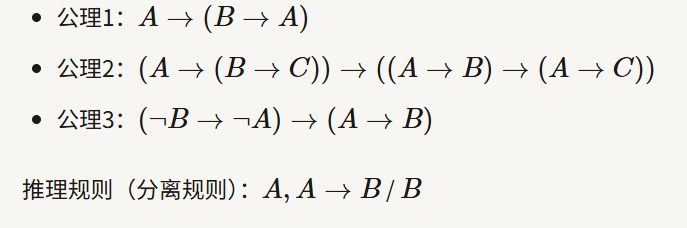
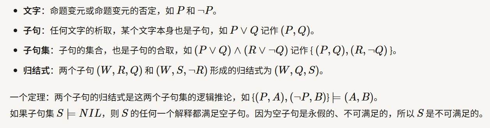
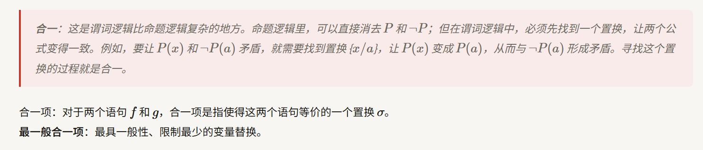

# 第一讲：绪论

## 1.1人工智能的三大学派

**(1)符号主义**

认为人工智能来源于数理逻辑，人类的认知过程本质上是对符号的运算过程（即“物理符号系统假设”），智能可以通过对符号的表示、存储、检索和推理来实现。

主要方法：知识表示、逻辑推理、专家系统。

优点：逻辑严密，可解释性强，推理过程透明，适合处理逻辑性强、规则明确的问题（如数学证明、棋类博弈早期版本）。
缺点：难以处理模糊、不确定的信息；知识获取困难（“知识瓶颈”）；缺乏自学习能力，难以模拟人类的直觉和感知。

**(2) 连接主义**

认为人工智能源于仿生学，特别是对人脑神经元结构和工作机制的模拟，智能产生于大量简单单元（神经元）之间的并行连接和相互作用，强调“学习”的过程，通过调整连接权重来适应环境。

主要方法：神经网络、深度学习、反向传播。

优点：具有强大的自学习能力、容错性和泛化能力；擅长处理图像识别、语音识别、自然语言处理等感知类和非线性问题。
缺点：模型通常是“黑盒”，可解释性差（难以解释为什么得出某个结论）；需要海量数据和巨大的计算资源；训练过程复杂。

**(3) 行为主义**

认为人工智能源于控制论和生物进化论，智能取决于感知和行动，是在与环境的交互中表现出来的（“感知-动作”模式），不需要复杂的内部表示或推理，智能是适应环境的结果。

主要方法：强化学习、遗传算法。

优点：强调实时性和适应性，适合动态环境下的决策和控制；不需要预先定义所有规则，通过与环境试错来优化策略。
缺点：训练周期长，探索成本高；在复杂任务中可能难以收敛到最优解。

# 第二讲：知识的表示和推理

人工智能的本质是知识的表示，人工智能是否成功取决于它所蕴含的知识表示是否清楚。

这一讲主要介绍了知识表示和推理的基本概念和方法。

## 2.1 知识表示

略

## 2.2 命题逻辑

### 2.2.1 命题演算形式系统

命题演算（又称命题逻辑）是数理逻辑的基础系统，研究的是复合命题与其组成部分之间的逻辑关系，而不涉及命题内部的结构；形式系统是一个符号体系，包含以下四个组成部分。

| 要素               | 说明                                 |
| ------------------ | ------------------------------------ |
| **字母表**   | 符号集合（命题变元、联结词、括号等） |
| **形成规则** | 如何构造合法的公式（合式公式）       |
| **公理**     | 系统中被承认为真的基本公式           |
| **推理规则** | 从已知公式推导出新公式的方法         |

### 2.2.2 证明与演绎

需要注意**证明**与**演绎**的区别。

* 证明：从公理出发，通过推理规则得到定理的有限公式序列，记作
* 推理：从假设/前提集出发，通过推理规则得出结论的过程，记作

### 2.2.3 希尔伯特演绎系统

三个公理：

## 2.3 一阶谓词逻辑

略

### 2.3.1 变量置换

置换是形如 {  } 的有限集合。

其中 {  } 是互不相同的变量，{  } 是项（常量、变量或函数）。

 表示将  替换为 ，前提是  中不含有 ，且不能出现循环置换。

> 变量的置换是可以复合的，且具有 **结合性** ，但不具有交换律。

## 2.4 逻辑推理

**逻辑推理**指的是用蕴涵推导出结论。
**模型验证**则是通过枚举所有可能的模型来验证在当前给定的知识库的前提下，结论都为真。

逻辑推理方法：演绎推理、归纳推理、溯因推理等。
这里主要关注演绎推理，包括自然演绎推理和归结推理。自然演绎推理已经在离散数学课程中学习过，这里主要介绍 **归结推理** 。

### 2.4.1 归结推理

归结推理是一种自动化的定理证明方法，核心思想是通过归结规则消去互补文字来推导矛盾。

概念：

### 2.4.2 命题逻辑的归结推理

推理步骤：
 **(1) 转化** ：将所有前提和“结论的否定”转化为 **合取范式 (CNF)** ，得到子句集。
 **(2) 归结** ：不断对子句集中的子句应用归结规则，生成新子句并加入集合。
 **(3) 终止** ：若推导出 **空子句** （表示矛盾），则证明原命题成立；若无法再生成新子句且未出现空子句，则原命题不成立。

### 2.4.3 谓词逻辑的归结推理

谓词逻辑的归结推理步骤：转化、合一、归结、终止。
可以看到，谓词逻辑的归结推理与命题逻辑类似，但需要考虑 **合一** ，同时第一步**转化**也会更加复杂一些。

## **归结推理的核心步骤和逻辑：**

---

### 1. 预处理：化为子句集

**在进行归结之前，必须将所有的逻辑表达式转换成 子句集（Clause Set） 。这通常涉及以下步骤：**

* **消去蕴涵符号 （如 $A \to B$ 变为 $\neg A \vee B$）。**
* **标准化变量 ：确保每个量词控制的变量名唯一。**
* **消去存在量词（Skolem化） ：用常量或 Skolem 函数替换存在量词。**
* **化为前束范式 ：将所有全称量词移到公式最左边。**
* **消去全称量词 ：默认所有变量都是全称泛指的。**
* **化为合取范式（CNF） ：最终得到一系列由析取（或）连接的文字组成的“子句”。**

### 2. 置换与合一（Unification）

**这是谓词逻辑归结与命题逻辑归结最大的区别。由于谓词中含有变量，我们需要找到一个 最一般置换（MGU） ，使得两个看似不同的谓词变得相同。**

> **例子：**
>
> * **子句 $C_1: P(x) \vee Q(a)$**
> * **子句 $C_2: \neg P(b) \vee R(y)$**
>
> **为了归结 $P(x)$ 和 $\neg P(b)$，我们需要令置换 $\sigma = \{b/x\}$。这样 $P(x)$ 变成了 $P(b)$，从而可以抵消。**

### 3. 归结规则

**给定两个子句 $C_1$ 和 $C_2$，如果 $C_1$ 中有一个文字 $L_1$，而 $C_2$ 中有一个文字 $L_2$，且 $L_1$ 与 $\neg L_2$ 是 可合一的 （存在置换 $\sigma$ 使得 $L_1\sigma = \neg L_2\sigma$），那么可以从这两个子句推导出 归结式（Resolvent） ：**

$$
Res(C_1, C_2) = (C_1\sigma - \{L_1\sigma\}) \cup (C_2\sigma - \{L_2\sigma\})
$$

### 4. 证明过程：反证法

**归结证明的具体流程如下：**

1. **将已知条件（公理）全部化为子句，组成子句集 $S$。**
2. **将要证明的结论取反，化为子句后加入 $S$。**
3. **不断从 $S$ 中选择两个可以归结的子句，计算其归结式。**
4. **将新的归结式加入 $S$。**
5. **目标 ：如果推导出了 空子句（$\square$** 或 NIL）** ，说明原公式集中存在矛盾，从而证明了原结论成立。**

---

### 归结推理示例

**假设我们要证明“苏格拉底会死”：**

* **已知 1 ：所有人都会死。 $\forall x (Man(x) \to Mortal(x))$**
* **已知 2 ：苏格拉底是人。 $Man(Socrates)$**
* **结论 ：苏格拉底会死。 $Mortal(Socrates)$**

**步骤：**

1. **子句集化 ：**

* **$C_1: \neg Man(x) \vee Mortal(x)$**
* **$C_2: Man(Socrates)$**

1. **结论取反 ：**

* **$C_3: \neg Mortal(Socrates)$**

1. **归结 ：**

* **$C_1$ 与 $C_2$ 归结（置换 $\{Socrates/x\}$）：得到 $C_4: Mortal(Socrates)$**
* **$C_4$ 与 $C_3$ 归结：得到 $\square$（矛盾）**

1. **结论 ：证明成功。**

---

### 归结推理的策略

**由于子句集可能会产生爆炸式的组合，通常会采用一些策略来提高搜索效率：**

* **删除策略 ：删除包含纯文字或重言式（如 $P \vee \neg P$）的子句。**
* **支持集策略（Set of Support） ：要求每次归结至少有一个子句是由目标结论演变而来的。**
* **线性归结 ：每次归结都使用上一步产生的归结式与原始子句集中的子句进行。**

## 如何理解最一般合一项

好的，以下是为你提供的完整复述内容，严格保持原意且 **标题不超过三级** ：

---

### 1. 什么是“合一” (Unification)？

“合一”简单来说就是  **找相同** 。给定两个包含变量的逻辑表达式（项） **$s$** 和  **$t$** ，如果能找到一个代换  **$\sigma$** （即把变量替换成某些项的规则），使得应用代换后两个表达式完全一样，即：

$$
s\sigma = t\sigma
$$

那么这个 **$\sigma$** 就被称为  **合一项 (Unifier)** 。

**例子：**

* 项 1：**$f(x, g(y))$**
* 项 2：**$f(A, z)$**
* 如果我们令  **$\sigma = \{x/A, z/g(y)\}$** ，那么两边都变成了  **$f(A, g(y))$** 。所以 **$\sigma$** 是一个合一项。

---

### 2. 为什么要加“最一般” (Most General)？

对于同一组表达式，合一项往往不止一个。有些合一项会引入“多余”的限制，而 **MGU** 则是那个**限制最少、最具有代表性**的合一项。

**核心定义：**

如果 **$\sigma$** 是一个 MGU，那么对于任何其他的合一项  **$\sigma'$** ，都存在一个代换  **$\delta$** ，使得：

$$
\sigma' = \sigma \circ \delta
$$

这意味着， **任何其他的合一项都可以通过在 MGU 的基础上进一步代换得到** 。MGU 处于代换“树”的根部，保留了最大的灵活性。

---

### 3. 直观理解：不要过度约束

想象你在为一个团队设计制服：

* **要求 1** ：小明的上衣颜色要和小红一样。
* **要求 2** ：小红的裤子要是蓝色的。

**方案 A (MGU)：**

让小明的上衣和小红的一样（变量绑定），且裤子全是蓝色。至于上衣具体是什么颜色（红色？白色？）， **先不决定** ，留给以后。这就是“最一般”的。

**方案 B (普通合一项)：**

强制要求小明和小红都穿“红上衣+蓝裤子”。虽然满足了要求，但它增加了“红色”这个多余的限制。万一以后要求制服必须是绿色的，方案 B 就废了，而方案 A 还能用。

---

### 4. 算法视角：如何找到 MGU？

寻找 MGU 的过程本质上是一个**递归消元**的过程。常用的 Robinson 算法步骤如下：

1. **从左向右扫描** ：对比两个项，找到第一个不一致的地方。
2. **检查变量** ：

* 如果不一致的地方其中一个是变量  **$x$** ，另一个是项  **$t$** 。
* **Occurrence Check (出现检查)** ：确认 **$x$** 是否出现在 **$t$** 中。如果没出现，就把 **$x$** 替换为  **$t$** ，并对全文应用这个代换。

1. **重复** ：直到两个项完全相同。

---

### 5. 为什么它很重要？

在计算机科学中，MGU 几乎无处不在：

* **Prolog 语言** ：执行查询的核心机制就是合一。
* **类型推导 (Type Inference)** ：像 Haskell 或 C++ 模板推导，编译器通过 MGU 确定函数参数的最精确类型。
* **归结原理 (Resolution)** ：在自动证明题中，通过 MGU 将两个子句中的矛盾项对消。

**总结：**

**合一项**让两个式子相等，而**最一般合一项**在让它们相等的同时， **尽量不给变量赋值具体的实义内容** ，从而保证了这个解可以被应用到更广泛的场景中。
