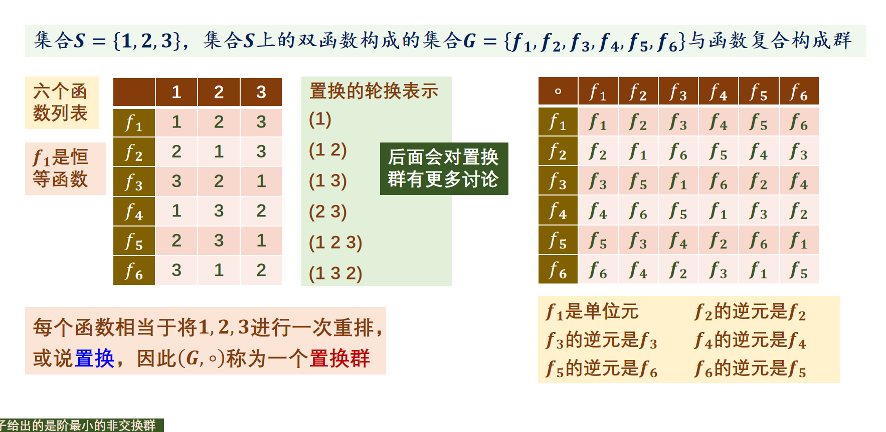
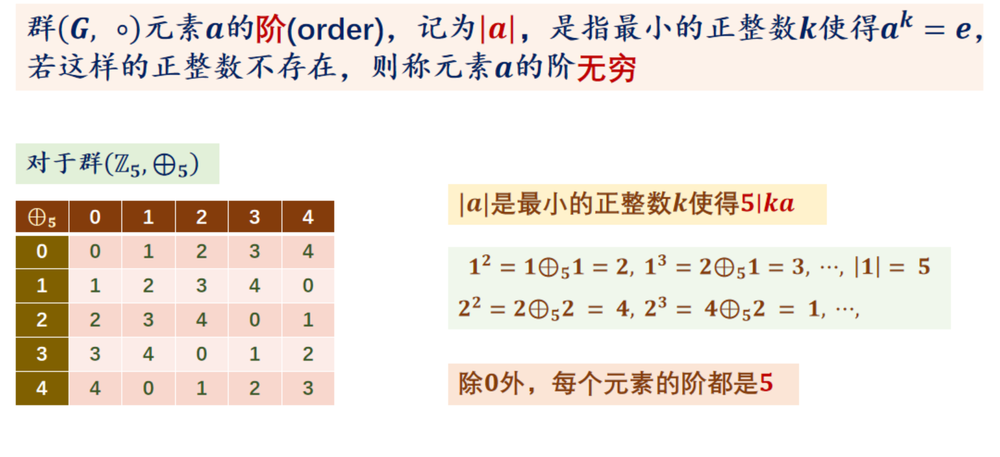
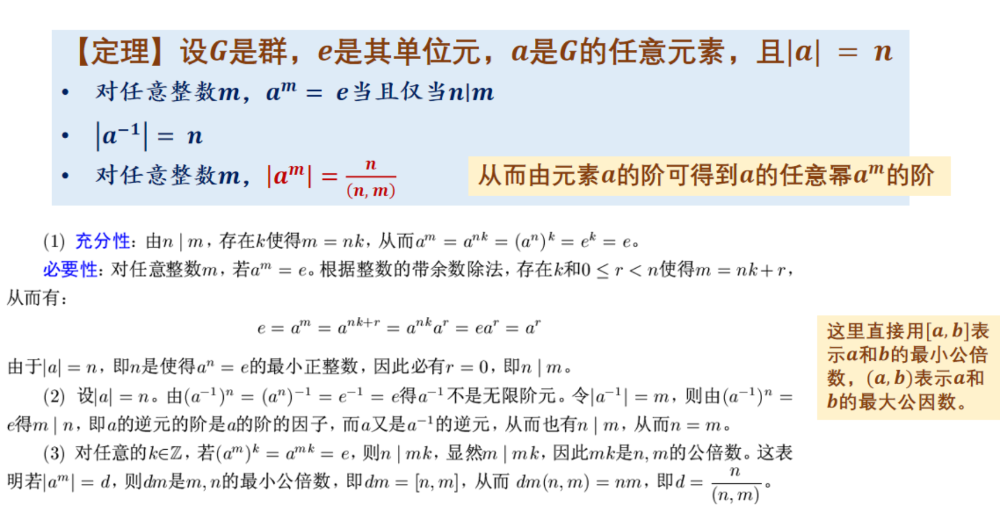
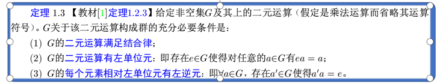
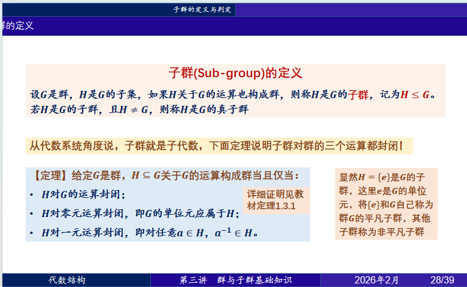
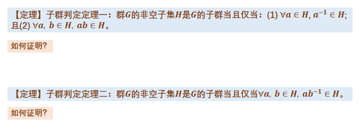
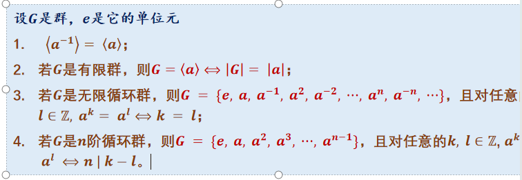
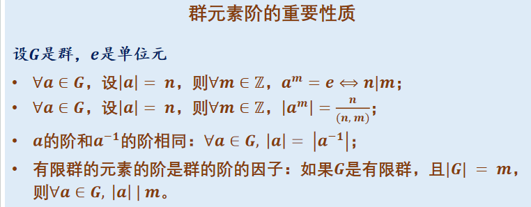
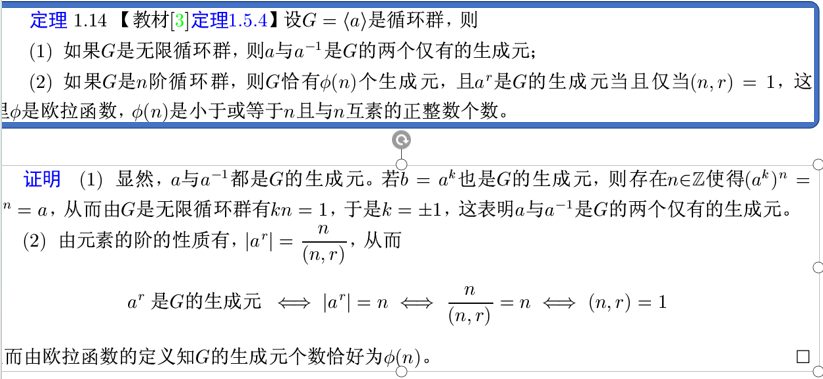
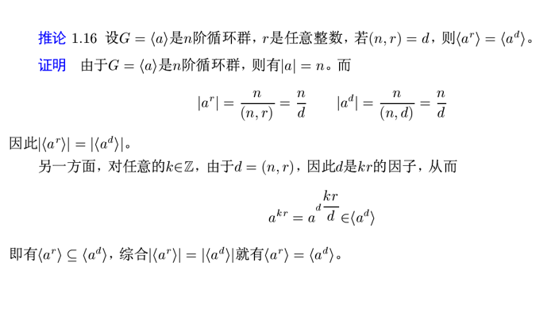

# 二元运算前置知识

这些“前置知识”统称为 **二元运算的性质** 。

你可以想象你在定义一个游戏规则：在一个集合（比如一堆数字或一堆函数）里，任选两个元素进行某种操作（加法、乘法、复合等），这个操作满足什么特征？

以下是核心概念的拆解：

---

### 1. 单位元 (Identity Element) —— “不动点”

单位元就像是运算中的“透明人”，它和任何元素结合，都不会改变那个元素。

* **加法单位元** ：通常是 **$0$**，因为 **$a + 0 = a$**。
* **乘法单位元** ：通常是 **$1$**，因为 **$a \times 1 = a$**。
* **函数复合单位元** ：是恒等函数 **$f(x) = x$**。
* **矩阵单位元** ：是单位矩阵 **$I$**。

> **注意** ：在一个系统中，单位元如果存在，通常是**唯一**的。

### 2. 逆元 (Inverse Element) —— “撤销器”

如果一个元素 **$a$** 与另一个元素 **$b$** 运算后，结果正好变成了 **单位元** ，那么 **$b$** 就是 **$a$** 的逆元。

* **加法逆元** ：**$a$** 的逆元是 **$-a$**，因为 **$a + (-a) = 0$**。
* **乘法逆元** ：**$a$** 的逆元是 **$1/a$**（前提是 **$a \neq 0$**），因为 **$a \times (1/a) = 1$**。
* **矩阵逆元** ：**$A$** 的逆元是 **$A^{-1}$**，满足 **$AA^{-1} = I$**。

### 3. 零元 (Zero Element) —— “黑洞”

零元（通常在“环”或“域”中讨论乘法时出现）是一个霸道的元素，任何东西碰上它都会变成它自己。

* **定义** ：对于任何 **$a$**，都有 **$a \cdot z = z \cdot a = z$**。
* **例子** ：实数乘法中的 **$0$** 就是零元。无论你拿多大的数乘 **$0$**，结果都是 **$0$**。
* **关键区别** ：**单位元**是保持对方不变，**零元**是把对方吞噬变成自己。
* 零元是针对“一整套运算规则”定义的，但它通过集合中一个“具体的特殊元素”表现出来

 **在【加法】运算中** ：

* 数字 **$0$** 扮演的是 **单位元** （**$a + 0 = a$**），因为它不改变别人。
* 此时加法运算通常 **没有零元** （因为不存在一个数 **$z$**，使得 **$a + z = z$** 对所有 **$a$** 成立）。

### 4. 结合律与交换律 —— “顺序与位置”

这是定义运算“好不好使”的关键：

* **结合律 (Associativity)** ：**$(a \cdot b) \cdot c = a \cdot (b \cdot c)$**。
* 只要满足结合律，我们写 **$a \cdot b \cdot c$** 就不用担心加括号的问题。**群必须满足结合律。**
* **交换律 (Commutativity)** ：**$a \cdot b = b \cdot a$**。
* 满足交换律的群叫 **阿贝尔群** （如整数加法）。
* **不满足**交换律的典型例子：矩阵乘法、函数复合（你刚才看的置换群表格里，**$f_2 \circ f_3$** 就不一定等于 **$f_3 \circ f_2$**）。

# lecture3

## 3.1群的定义

在抽象代数中，**群 (Group)** 是由一个集合以及定义在该集合上的一个二元运算所组成的代数结构。要称一个集合 **$G$** 与其上的运算 **$\cdot$**（通常称为“乘法”，但可以是加法或其他运算）构成一个群，必须满足以下  **四个公理** ：

### 1. 封闭性 (Closure)

对于集合 **$G$** 中任意两个元素 **$a$** 和 **$b$**，它们的运算结果 **$a \cdot b$** 必须仍然属于集合 **$G$**。

* 公式表示：**$\forall a, b \in G, a \cdot b \in G$**

### 2. 结合律 (Associativity)

对于集合 **$G$** 中任意三个元素 **$a, b, c$**，改变运算的顺序（即括号的位置）不影响最终结果。

* 公式表示：**$\forall a, b, c \in G, (a \cdot b) \cdot c = a \cdot (b \cdot c)$**

### 3. 单位元 (Identity Element)

集合 **$G$** 中必须存在一个特殊的元素 **$e$**（有时记作 **$1$** 或 **$0$**），使得它与任何元素 **$a$** 运算后，结果仍为 **$a$**。

* 公式表示：**$\exists e \in G, \forall a \in G, e \cdot a = a \cdot e = a$**

### 4. 逆元 (Inverse Element)

对于集合 **$G$** 中的每一个元素 **$a$**，在 **$G$** 中都必须存在一个对应的元素 **$b$**（记作 **$a^{-1}$**），使得它们运算的结果等于单位元 **$e$**。

* 公式表示：**$\forall a \in G, \exists a^{-1} \in G, a \cdot a^{-1} = a^{-1} \cdot a = e$**

### 5.群的阶

群G元素的个数称为群的阶，有穷群，无穷群

### 6.加群与乘群

当群的G的运算用加号'+'表示时，通常将它单位元记为0，元素a的逆元记为−a，并将这个运算称为加法，运算的结果称为和，这个群称为加群
**通常只有当群是交换群的时候，才使用加号'+'表示这个群的运算**

所有满足乘群的计算都满足加群

将不是加群的群称为乘群，并将其运算称为乘法，运算结果称为积
乘群的单位元通常用1或e表示，元素a的逆元用a^−1表示
乘群的运算用∘, ⋅或∗表示，但通常省略不写！

### 7.群的性质

群有单位元，因此群不可能是空集
群要求每个元素都有逆元，而运算的零元不可能有逆，因此群没有零元（除平凡群({e}, ∘)外）！

---

### 常见的例子与非例子

| **集合与运算**                                             | **是否为群** | **原因**                                                          |
| ---------------------------------------------------------------- | ------------------ | ----------------------------------------------------------------------- |
| **整数集合**$\mathbb{Z}$**与加法**$+$****        | **是**       | 封闭；满足结合律；单位元是 0；**$n$**的逆元是**$-n$**。 |
| **实数集合**$\mathbb{R}$**与乘法**$\times$****   | **否**       | **0 没有乘法逆元** （没有数乘以 0 等于 1）。                      |
| **非零实数**$\mathbb{R} \setminus \{0\}$**与乘法** | **是**       | 单位元是 1；**$a$**的逆元是**$1/a$**。                  |
| **自然数集合**$\mathbb{N}$**与加法**$+$****      | **否**       | **缺少逆元** （除了 0 以外，正整数没有负整数对应的逆元）。        |

## 3.2为什么普通模乘不能构成群？

要理解为什么 **$U(m) = \{a \mid a \in \mathbb{Z}_m, \gcd(a, m) = 1\}$** 在模 **$m$** 乘法 **$\otimes_m$** 下 **构成群** ，而普通的 **$\mathbb{Z}_m$**  **不构成群** ，我们需要对比群的四个公理。

---

### 1. 为什么 **$\mathbb{Z}_m$** 在乘法下不构成群？

核心原因在于： **逆元（Inverse Element）不存在** 。

在一个乘法群中，每个元素 **$a$** 都必须有一个逆元 **$a^{-1}$**，使得 **$a \otimes_m a^{-1} = 1$**。

* **0 的问题** ：在任何模 **$m > 1$** 的情况下，**$0 \otimes_m x = 0$**。永远无法得到 **$1$**，所以 **$0$** 没有逆元。
* **非零元素的问题** ：即使排除 **$0$**，如果 **$\gcd(a, m) > 1$**（即 **$a$** 与 **$m$** 有公约数），**$a$** 也没有逆元。
* *例子* ：在 **$\mathbb{Z}_6 = \{0, 1, 2, 3, 4, 5\}$** 中，考虑元素 **$2$**。
* **$2 \times 0 = 0, 2 \times 1 = 2, 2 \times 2 = 4, 2 \times 3 = 0, 2 \times 4 = 2, 2 \times 5 = 4$**。
* 没有任何数能让 **$2 \otimes_6 x = 1$**。因此 **$2$** 没有逆元。

---

### 2. 为什么 **$U(m)$** 能够构成群？

通过限定 **$a$** 与 **$m$** 互质，我们精准地剔除了那些“坏”元素。

#### A. 封闭性 (Closure)

如果 **$\gcd(a, m) = 1$** 且 **$\gcd(b, m) = 1$**，那么根据数论性质，它们的乘积与 **$m$** 也一定互质，即 **$\gcd(ab, m) = 1$**。因此 **$a \otimes_m b$** 仍在 **$U(m)$** 中。

#### B. 结合律 (Associativity)

模乘法本质上源于整数乘法，而整数乘法满足结合律，取模操作不改变这一点。

#### C. 单位元 (Identity)

**$1$** 永远与任何整数 **$m > 1$** 互质，所以 **$1 \in U(m)$**。且 **$1 \otimes_m a = a \otimes_m 1 = a$**。

#### D. 逆元 (Inverse) —— 最关键的一点

根据  **裴蜀定理 (Bézout's Identity)** ，如果 **$\gcd(a, m) = 1$**，那么一定存在整数 **$x$** 和 **$y$** 使得：

$$
ax + my = 1
$$

将等式两边同时模 **$m$**：

$$
ax \equiv 1 \pmod{m}
$$

这里的 **$x \pmod{m}$** 就是 **$a$** 在模 **$m$** 意义下的乘法逆元。因为 **$ax + my = 1$** 也暗示了 **$\gcd(x, m) = 1$**，所以这个逆元 **$x$** 也在 **$U(m)$** 集合中。

---

### 3. 直观总结

| **集合**             | **包含元素**             | **满足公理** | **结论**                                         |
| -------------------------- | ------------------------------ | ------------------ | ------------------------------------------------------ |
| **$\mathbb{Z}_m$** | **$0, 1, \dots, m-1$** | 封闭、结合、单位元 | **不是群** （零元及与**$m$**不互质的数无逆元） |
| **$U(m)$**         | 与**$m$**互质的数            | **全部满足** | **是群** （称为模**$m$**的乘法群/单位群）      |

## 3.3置换洗牌——群的具体例子

这张图展示的是群论中最经典的例子之一： **$S_3$ 对称群** （也叫 3 个元素的置换群）。

我们可以把这 6 个函数看作对三个位置 **$\{1, 2, 3\}$** 上的物体进行“洗牌”或“重排”的 6 种不同动作。为了看懂这张图，我们分三步拆解：

---

### 1. 左侧列表：这 6 个函数（动作）到底在干什么？

图中的表格描述了每个函数如何改变 1, 2, 3 的位置：

* **$f_1$ (恒等函数)** ：1→1, 2→2, 3→3。 **什么都没变** ，所以它是 **单位元** 。
* **$f_2$** ：1 和 2 互换位置，3 不动。
* **$f_5$** ：1 变成 2，2 变成 3，3 变成 1。就像是大家往后挪了一位。

> **轮换表示法 (1 2 3)** 的意思就是：1 走到 2 的位置，2 走到 3 的位置，3 绕回 1 的位置。

---

### 2. 右上角：复合运算表（凯莱表）

这个表格展示了“连续执行两个动作”的结果。

**注意：函数的复合是从右往左读的，**$f_i \circ f_j$** 表示先做 **$f_j$**，再做 **$f_i$**。**

**例子：为什么 **$f_2 \circ f_2 = f_1$**？**

1. 先执行 **$f_2$**：1 和 2 互换了。
2. 再执行一次 **$f_2$**：1 和 2 又换回来了。
3. 结果：回到了初始状态 **$f_1$**。这说明  **$f_2$ 的逆元就是它自己** 。

**例子：为什么 **$f_2 \circ f_3 = f_6$**？**

1. 先做 **$f_3$**：1 变成 3，3 变成 1（2 不动）。
2. 再做 **$f_2$**：1 和 2 互换。
3. 追踪数字 1 的变化：**$1 \xrightarrow{f_3} 3 \xrightarrow{f_2} 3$**。最终 1 变成了 3。
4. 追踪数字 2 的变化：**$2 \xrightarrow{f_3} 2 \xrightarrow{f_2} 1$**。最终 2 变成了 1。
5. 结果就是：1→3, 2→1, 3→2。查左边的表，这正好对应 **$f_6$**。

---

### 3. 右下角：逆元的直观理解

逆元就是能让你“ **撤销** ”刚才操作的动作，让系统回到 **$f_1$**（初始状态）。

* **$f_2, f_3, f_4$** ：这三个都是“互换两个数”，再换一次就回来了，所以它们的逆元是 **自己** 。
* **$f_5$ 和 **$f_6$**** ：
* **$f_5$** 是“全员向后挪一位” (**$1 \to 2 \to 3 \to 1$**)。
* 要撤销它，你需要“全员向前挪一位” (**$1 \to 3 \to 2 \to 1$**)，这正好是 **$f_6$**。
* 所以  **$f_5$ 的逆元是 **$f_6$**** ，反之亦然。

---

### 总结

这张图的核心意义在于证明：

1. **封闭性** ：任意两个“洗牌”动作复合，结果还是这 6 种洗牌方式之一。
2. **单位元** ：**$f_1$**（不动）存在。
3. **逆元** ：每种洗牌都有对应的“反向洗牌”能回到原位。

这种结构不仅在离散数学中有用，在计算硬件的指令调度、甚至是魔方的解法公式中，底层逻辑都是这样的置换群。

## 3.4 阿贝尔群

满足交换律的群称为阿贝尔群

## 3.5 元素的阶

### 1. 什么是元素的“阶”？

直白地说， **阶就是你把一个动作重复做多少次，能第一次回到原点（单位元）** 。

* **符号表示** ：如果 **$a^n = e$**，且 **$n$** 是满足这个条件的最小正整数，我们就说元素 **$a$** 的阶是 **$n$**。
* **在加法群中** ：这里的 **$a^n$** 指的是 **$n$** 个 **$a$** 相加。即 **$n \cdot a \equiv 0 \pmod m$**。
* **在置换群中** ：这里的 **$a^n$** 指的是动作的复合。即连续执行 **$n$** 次相同的洗牌动作后，顺序变回 **$1, 2, 3$**。

---

### 2. 结合图片看实例

#### **置换群 **$S_3$**（图 1）**

* **$f_1$ 的阶** ：它是单位元，做 1 次就回到了原点，所以它的 **阶是 1** 。
* **$f_2$ 的阶** ：它是互换 1 和 2。换一次变了，换两次就回来了（**$f_2 \circ f_2 = f_1$**），所以它的 **阶是 2** 。
* **$f_5$ 的阶** ：它是轮换 (1 2 3)。转动一次变了，转两次还没回来，转第三次才彻底复位。所以它的 **阶是 3** 。

#### **模 7 加法群 **$\mathbb{Z}_7$**（图 2）**

题目问的是 **$\mathbb{Z}_7 = \{0, 1, 2, 3, 4, 5, 6\}$** 中元素的阶（单位元是  **0** ）。我们来算一下：

* **元素 2 的阶** ：
* **$2$**
* **$2+2=4$**
* **$2+2+2=6$**
* **$2+2+2+2=8 \equiv 1$**
* **$2+2+2+2+2=10 \equiv 3$**
* **$2+2+2+2+2+2=12 \equiv 5$**
* **$2+2+2+2+2+2+2=14 \equiv 0$**（回到原点！）
* **结论** ：2 连加了 7 次才回到 0，所以  **2 的阶是 7** 。选项 A 错误。
* **规律发现** ：因为 7 是质数，在 **$\mathbb{Z}_7$** 加法群中，除了单位元 0 的阶是 1 外， **所有其他元素（1到6）的阶全都是 7** 。

> **所以，选项 B, C, D 说的阶是 5, 6, 7 里面，只有 D 是正确的。**

---

### 3. “阶”的直观意义

你可以把阶想象成**时钟**或 **转盘** ：

* 如果一个动作的阶是 2，说明它像个 **开关** ，按两下就复原。
* 如果一个动作的阶是 7，说明它像一个  **7 角星的行走路径** ，你得走完 7 步才能回到起点。

### 4.！！！ 性质（帮你秒杀考题）

1. **单位元的阶永远是 1** 。
2. **有限群中，元素的阶一定能整除群的大（阶）小** 。

* 比如 **$S_3$** 有 6 个元素，元素的阶只能是 1, 2, 3 或 6。
* 比如 **$\mathbb{Z}_7$** 有 7 个元素，元素的阶只能是 1 或 7。

1. **一个元素和它的逆元，阶是一样的** 。
2. 

## 3.6定理证明：满足结合律与消去律的有限非空集 **$G$** 构成群

#### 1. 证明单位元 **$e$** 的存在性

假设 **$G = \{a_1, a_2, \dots, a_n\}$** 是一个含有 **$n$** 个不同元素的有限集。

取其中任意一个元素 **$a \in G$**，构造一组新的元素：

$$
\{a a_1, a a_2, \dots, a a_n\}
$$

* **利用消去律** ：如果 **$a a_i = a a_j$**，根据左消去律，必有 **$a_i = a_j$**。
* **利用有限性** ：因为这 **$n$** 个乘积各不相同，且都属于 **$G$**，所以这 **$n$** 个结果正好就是原集合 **$G$** 的一个 **重排** （就像洗牌一样）。
* **推导** ：既然结果涵盖了整个 **$G$**，那么对于原本就在 **$G$** 里的元素 **$a$**，一定存在某个 **$e \in G$**，使得：

$$
$$a e = a
$$

* **验证** ：对于 **$G$** 中任意其他元素 **$x$**，由于 **$a(ex) = (ae)x = ax$**，由左消去律得 **$ex = x$**。同理可证 **$xe = x$**。因此，**$e$** 是双边单位元。

#### 2. 证明逆元 **$a^{-1}$** 的存在性

同样利用刚才的“重排”逻辑。对于刚才选定的单位元 **$e \in G$**：

* 既然 **$\{a a_1, a a_2, \dots, a a_n\}$** 填满了整个 **$G$**，那么一定存在某个元素（假设叫 **$a_i$**），使得：
  $$
  a a_i = e
  $$
* 这个 **$a_i$** 就是 **$a$** 的右逆元。同理可证左逆元也存在且相等。

**证明完毕。**

---

### 💡 深度总结：为什么“有限”是关键？

这个证明里最惊险的一步是**“单射必满射”**。

* **在有限集里** ：一个萝卜一个坑，如果你能证明没有两个萝卜进同一个坑（单射），那么所有的坑一定会被填满（满射）。所以“单位元”和“逆元”这两个坑一定能被占上。
* **在无限集里** ：坑是无穷无尽的。比如在正整数集 **$(\mathbb{Z}^+, +)$** 中，让每个数加 1（**$x \to x+1$**）。这也是单射（没有两个数加 1 后相等），但它 **不是满射** ，因为“1”这个坑永远填不上（没有正整数加 1 等于 1）。所以它没有单位元，也就成不了群。

## 3.7群的判定定理

要证明定理 1.3 成立，本质上是要通过**“左单位元 + 左逆元” **推导出群定义中要求的** “右单位元 + 右逆元”**。

这是一个非常优美的逻辑推导过程，我们可以分三步来完成：

---

#### 第一步：证明左逆元也是右逆元

假设 **$a'$** 是 **$a$** 的左逆元（**$a'a = e$**），我们要证明 **$aa' = e$**。

1. 根据条件 (3)，**$a'$** 作为 **$G$** 中的元素，也一定有一个左逆元，设为 **$a''$**，即 **$a''a' = e$**。
2. 利用结合律观察 **$a' (aa')$**：
   * 一方面：**$a' (aa') = (a'a) a' = e a' = a'$** （利用左单位元性质）。
   * 另一方面：我们在等式 **$a' (aa') = a'$** 两边同时**左乘** **$a''$**：

     $$
     a'' [a' (aa')] = a'' a'
     $$

     $$
     (a'' a') (aa') = e
     $$

     （利用左逆元定义）

     $$
     e (aa') = e
     $$

     $$
     aa' = e
     $$

     （利用左单位元性质）
3. **结论** ：左逆元 **$a'$** 同时也满足右逆元的性质。

---

#### 第二步：证明左单位元也是右单位元

我们要证明对于任意 **$a \in G$**，**$ae = a$**。

1. 利用刚才证明出的“右逆元”结论：**$a'a = e$** 且 **$aa' = e$**。
2. 计算 **$ae$**：

   $$
   ae = a (a' a)
   $$

   $$
   ae = (aa') a
   $$

   （利用结合律）

   $$
   ae = e a
   $$

   （代入第一步的结论 **$aa' = e$**）

   $$
   ae = a
   $$

   （利用左单位元定义 **$ea = a$**）
3. **结论** ：这个左单位元 **$e$** 同时也满足右单位元的性质。

---

#### 第三步：总结判定逻辑

通过以上两步推导，我们发现：

* **单位元** ：**$ea = ae = a$**（双边成立）。
* **逆元** ：**$a'a = aa' = e$**（双边成立）。
* 再结合题目给出的**结合律**和 **封闭性** （由二元运算定义蕴含）。

 **最终结论** ：该系统完全符合群的原始定义，因此 **$G$** 构成群。

---

#### 💡 核心考点提醒

这个定理最精妙的地方在于： **方向必须一致** 。

* **左**单位元 + **左**逆元 = **群** ✅
* **右**单位元 + **右**逆元 = **群** ✅
* **左**单位元 + **右**逆元 = **不一定是群** ❌（这是一个非常经典的陷阱，除非是有限集）。

3.8子群

# lecture4

## 4.1循环群

### 4.1.1循环群与生成元

定义：设G是群，如果存在a∈G使得
G=⟨a⟩={a^k | k∈ℤ}
则称G是循环群(cyclic group)，并称a为G的一个生成元。当G是无限集时称为无限循环群，**当G有n个元素时，称为n阶循环群。**

是一个元素生成的群，循环群的性质于这个元素的阶有密切关系

回忆阶就是元素的自乘回到单位元的所需要的次数

### 4.1.2**模 **$n$** 的乘法群**

在代数中，**$U(n)$** 通常代表 **模 **$n$** 的乘法群** （Unit Group），也记作 **$\mathbb{Z}_n^\times$**。

* **元素集合** ：由 **$\{1, 2, \dots, n-1\}$** 中所有与 **$n$** **互质**的数组成。
* **运算规则** ：模 **$n$** 的 **乘法** 。
* 对于 **$U(13)$**，由于 13 是质数，从 1 到 12 的所有整数都与 13 互质，所以：
  $$
  U(13) = \{1, 2, 3, 4, 5, 6, 7, 8, 9, 10, 11, 12\}
  $$

### 4.1.3模n的加群

模 **$n$** 加群（通常记作 **$\mathbb{Z}_n$** 或 **$C_n$**）是群论中最基础、最规整的结构之一。它的元素集合是 **$\{0, 1, 2, \dots, n-1\}$**，运算是 **模 **$n$** 加法** 。

与你刚才看到的乘法群 **$U(n)$** 相比，**$\mathbb{Z}_n$** 的性质更加“完美”：

---

没问题，我会严格遵守**标题等级不超过三级（###）**的限制。

以下为你复述的关于模 **$n$** 加群 **$\mathbb{Z}_n$** 的核心性质：

---

#### 1. 结构性质：永远是循环群

这是 **$\mathbb{Z}_n$** 最核心的特征：无论 **$n$** 是多少，**$\mathbb{Z}_n$** 永远是一个循环群。

* **生成元** ：数字 **$1$** 永远是它的一个生成元（因为 **$1+1+\dots+1$** 可以得到集合中任何数）。
* **单位元** ：加法单位元永远是  **0** 。
* **逆元** ：元素 **$a$** 的逆元是 **$n - a$**（例如在 **$\mathbb{Z}_6$** 中，**$2$** 的逆元是 **$6-2=4$**）。

---

#### 2. 生成元的判定定理

虽然 **$1$** 总是生成元，但 **$\mathbb{Z}_n$** 通常还有其他的生成元。

* **判定定理** ：在 **$\mathbb{Z}_n$** 中，元素 **$k$** 是生成元的充要条件是  **$\gcd(k, n) = 1$** 。
* **生成元个数** ：正好等于欧拉函数值  **$\phi(n)$** 。

 **对比理解** ：

* 在 **$\mathbb{Z}_6$** 中，与 6 互质的有 1, 5，所以生成元是 **$\{1, 5\}$**。
* 在 **$\mathbb{Z}_{13}$** 中，因为 13 是质数，除了 0 以外的所有元素 **$\{1, 2, \dots, 12\}$** 都是生成元。

---

#### 3. 子群的结构：格点完备性

**$\mathbb{Z}_n$** 的子群结构非常清晰，遵循以下规律：

* **子群数量** ：**$n$** 有多少个正约数，**$\mathbb{Z}_n$** 就有多少个子群。
* **子群形式** ：每一个子群也一定是循环群。如果 **$d$** 是 **$n$** 的约数，那么由 **$d$** 生成的子群 **$\langle d \rangle$** 的阶为  **$n/d$** 。
* **拉格朗日定理的逆命题成立** ：对于一般群，阶为 **$d$** 的子群不一定存在；但在 **$\mathbb{Z}_n$** 这种循环群中，对于 **$n$** 的每一个正约数 **$d$**，都**恰好存在一个** **$d$** 阶子群。

---

#### 4. 与 **$U(n)$** 的深刻联系

你可能会发现，**$U(n)$** 的生成元个数 **$\phi(\phi(n))$** 和 **$\mathbb{Z}_n$** 的生成元个数 **$\phi(n)$** 经常被放在一起考。它们的本质区别在于：

| **特性**       | **模 n 加群 Zn** | **模 n 乘法群 U(n)**                  |
| -------------------- | ---------------------- | ------------------------------------------- |
| **元素个数**   | **$n$**        | **$\phi(n)$**                       |
| **单位元**     | 0                      | 1                                           |
| **运算封闭性** | 任意两数模**$n$**加  | 仅限与**$n$**互质的数模**$n$**乘  |
| **循环性**     | **总是**循环群   | **不一定** （例如**$U(8)$**就不是） |

---

#### 5. 快速判定练习

以 **$\mathbb{Z}_{12}$** 为例：

* **阶** ：12。
* **生成元有哪些？** 找与 12 互质的数：**$\{1, 5, 7, 11\}$**，共 4 个。
* **有多少个子群？** 12 的约数有 1, 2, 3, 4, 6, 12，所以共有 **6 个**子群。
* **$8$ 的阶是多少？** **$\frac{12}{\gcd(8, 12)} = \frac{12}{4} = 3$**。（即 **$8+8+8 = 24 \equiv 0 \pmod{12}$**）。

### 4.1.4！循环群生成元判定

在一个 **$m$** 阶循环群中，生成元的个数等于欧拉函数值 **$\phi(m)$**。（小于m并且和m互为素数的正整数的个数）

## 4.1.5循环群的性质

循环群的任意子群都是循环群

