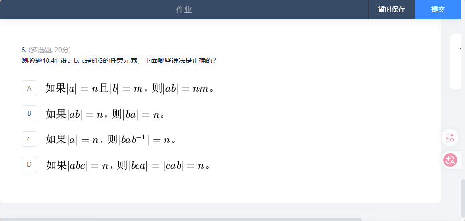

## 作业01

我们来分析图中的  **测验题 10.41** ：

### 1. 命题 A：如果 **$|a|=n, |b|=m$**，则 **$|ab|=nm$**？

* **结论** ： **错误** 。
* **理由** ：这个结论只在极少数情况下成立（比如 **$a, b$** 交换且阶互质）。
* **直观反例** ：在对称群 **$S_3$** 中（参照你之前的图），**$f_2$** 的阶是 2，**$f_3$** 的阶也是 2，但 **$f_2 f_3 = f_6$**，而 **$f_6$** 的阶是 3。**$3 \neq 2 \times 2$**。

### 2. 命题 B：如果 **$|ab|=n$**，则 **$|ba|=n$**？

* **结论** ： **正确** 。
* **证明思路** ：这是一个非常巧妙的“共轭”技巧。
  假设 **$(ab)^n = e$**，我们要证明 **$(ba)^n = e$**。
  我们可以把 **$(ba)^n$** 写开：**$ba \cdot ba \dots ba$**。
  注意中间的项：**$b(ab)(ab) \dots (ab)a = b(ab)^{n-1}a$**。
  两边同时左乘 **$a$** 右乘 **$a^{-1}$**，或者利用 **$(ba) = a^{-1}(ab)a$**。
  由于 **$ba$** 与 **$ab$** 是**共轭**的，共轭元素具有相同的阶。

### 3. 命题 C：如果 **$|a|=n$**，则 **$|bab^{-1}|=n$**？

* **结论** ： **正确** 。
* **核心点** ： **共轭作用不改变阶** 。

$$
(bab^{-1})^k = (bab^{-1})(bab^{-1}) \dots (bab^{-1})
$$

  中间的 **$b^{-1}$** 和 **$b$** 全部抵消掉，只剩下 **$ba^kb^{-1}$**。
  如果 **$a^n = e$**，那么 **$ba^nb^{-1} = beb^{-1} = e$**。
  这说明共轭就像是给元素“换了一身衣服”，但其循环的周期（阶）保持不变。

### 4. 命题 D：如果 **$|abc|=n$**，则 **$|bca|=|cab|=n$**？

* **结论** ： **正确** 。
* **理由** ：这其实是命题 B 的推广。
  我们可以把 **$abc$** 看作 **$(ab) \cdot c$**。根据命题 B，**$(ab)c$** 的阶等于 **$c(ab)$** 的阶。
  同理，**$b(ca)$** 的阶等于 **$(ca)b$** 的阶。
  这种性质叫做 **循环移位（Cyclic Permutation）** ，它不会改变乘积的阶。

---

### 💡 总结：关于“阶”的避坑指南

当你处理这些抽象命题时，记住三个“绝招”：

1. **共轭不变性** ：**$x$** 和 **$gxg^{-1}$** 阶相同。
2. **移位不变性** ：**$ab$** 和 **$ba$** 阶相同。
3. **交换性是奢侈品** ：除非题目说群是阿贝尔群（交换群），否则千万不要随便把 **$ab$** 拆成 **$ba$**。
