*表示有点陌生的

**表示重要的

）感觉不用特别去掌握

本提纲只记录基本概念加练习

# 一、图的基本概念

## 1、概念

## 2、几种典型的图

n阶完全图

偶图、完全偶图

*简单图的补图

*自补图：若 𝑛 阶图 𝐺 是自补图，则有 𝑛 = 4𝑘 或 4𝑘 + 1

## 3、握手定理

顶点的度、最小度最大度、奇点、偶点、*正则图

**握手定理：任意图中所有顶点的度的和等于边数的 2 倍

任何图奇点个数为偶数

正则图阶数和度数不同的时候为奇数

### 练习：

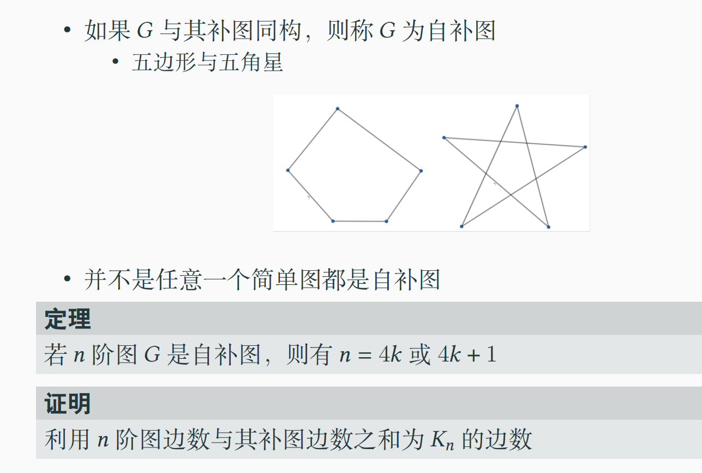

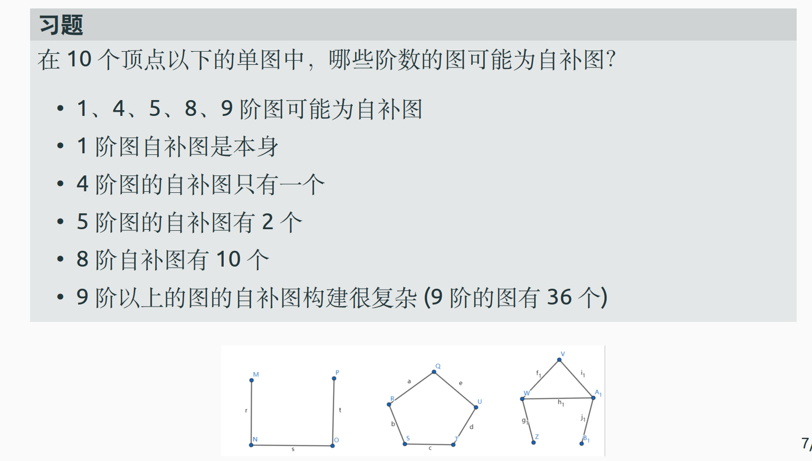

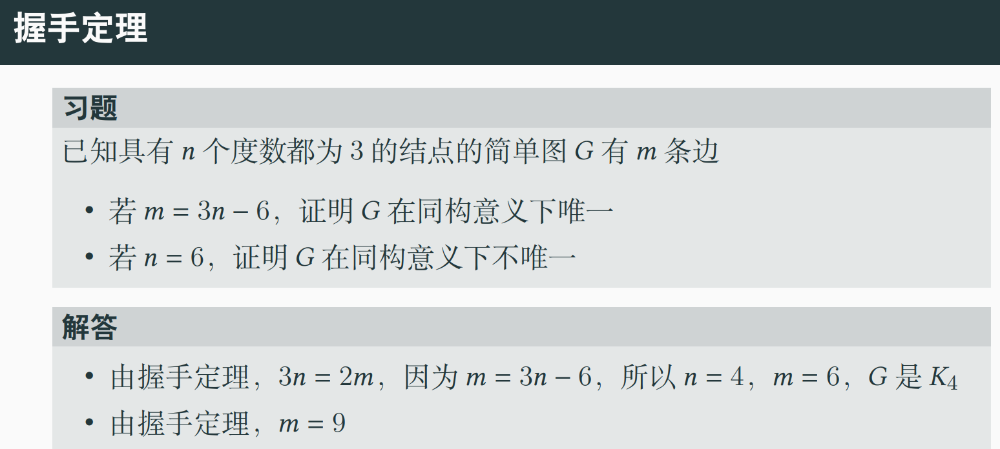

## 4、度序列

图 𝐺 的各个点的度 𝑑1, 𝑑2, · · · , 𝑑𝑛 构成的非负整数组 (𝑑1, 𝑑2, · · · , 𝑑𝑛) 称为𝐺 的度序列

度序列判别定理：非负整数组 (𝑑1, 𝑑2, · · · , 𝑑𝑛) 是图的度序列的充分必要条件是序列中元素总和
为偶数

可图序列（图序列）：非负整数组是某简单图的度序列

图序列判别定理：非负整数组 (𝑑1, 𝑑2, · · · , 𝑑𝑛), 𝑑1 ≥ 𝑑2 ≥ · · · ≥ 𝑑𝑛, 是图序列的充分必要条件是
(𝑑2 − 1, 𝑑3 − 1, · · · , 𝑑𝑑1+1 − 1, 𝑑𝑑1+2, · · · , 𝑑𝑛) 是图序列

一个简单图G的n个点的度不可能互不相同，也就是说必定有两个点的度相等（任何两个或两个以上人的组内，存在两个人在组内有相同个数的朋友）

### 练习

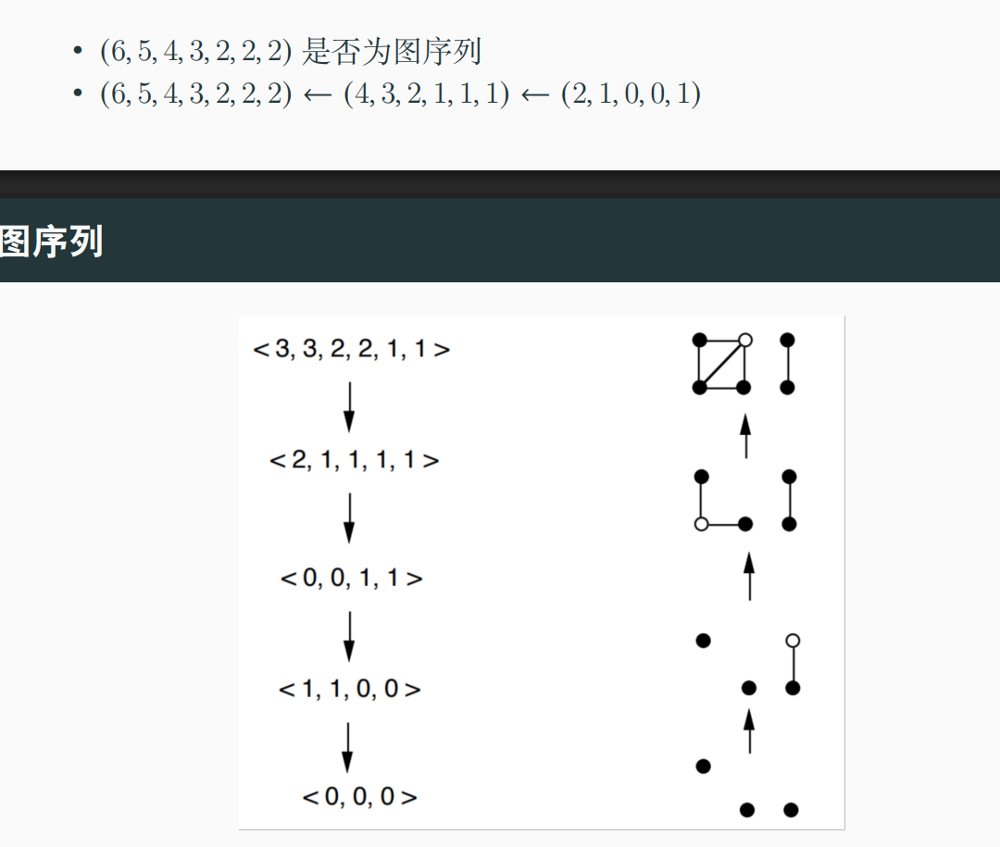

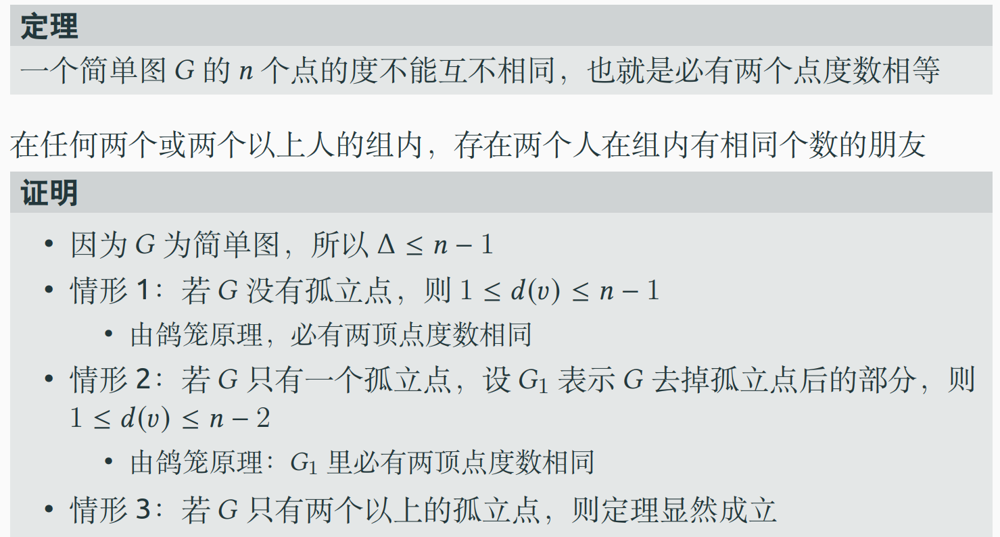

## 5、子图

H是一个图，如果𝑉 (𝐻) ⊆ 𝑉 (𝐺)，𝐸(𝐻) ⊆ 𝐸(𝐺)，则𝐻 为 𝐺 的子图，记为 𝐻 ⊆ G

点导出子图

边导出子图

生成子图（理解，简单图有2的m次方个生成子图，其实就是m条边取与不取）

## 6、图运算

删点：𝐺 −𝑉：删去𝑉 中的点及相关联的边

删边: 𝐺 − 𝐸：删去 𝐸 中的边

并运算：用两个图中点和边构成新图。如果 𝐺 与 𝐻 不相交 (没有公共顶点)，称它们的并为直接并，记为 𝐺 + H

交运算：

差运算：𝐺 − 𝐻：从 𝐺 中删去 𝐻 中的边得到的新图（实质批量删边）

对称差运算：𝐺Δ𝐻 = (𝐺 ∪ 𝐻) − (𝐺 ∩ 𝐻)

联运算：设 𝐺 和 𝐻 是两个不相交的图，作 𝐺 + 𝐻，并且将 𝐺 中每个点和𝐻 中的每个点连接(感觉像生成一个完全二部图，实质不是但是很像)

*积运算

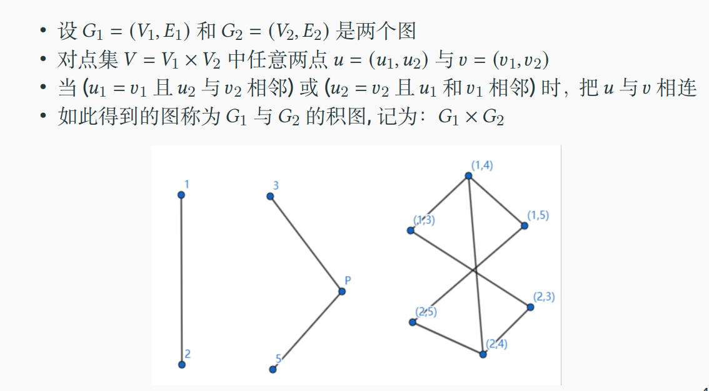

*合成运算（也有点像生成二部图，可以理解成“把一个图的每个点替换成一份小图，然后按原图的边在小图之间加完全二部连接”。）

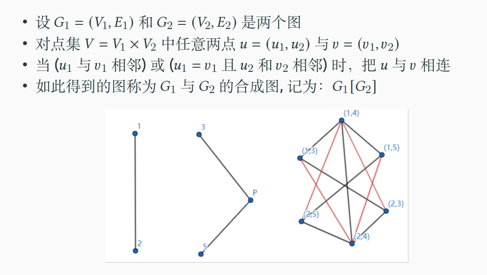

## 7、连通性

途径

迹：边不重复

路：点不重复

*傻逼玩意儿

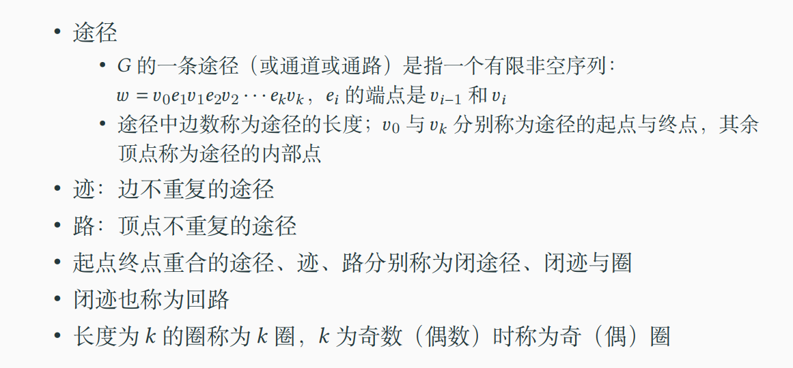

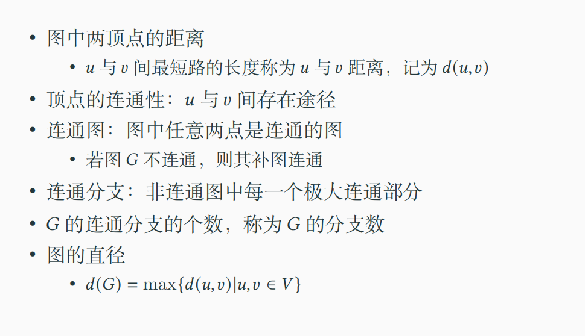

一个图是偶图（二部图）当且仅当它不包含奇圈

### 练习：

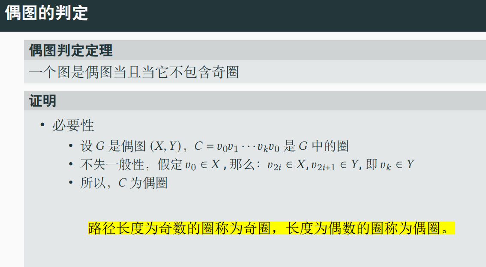

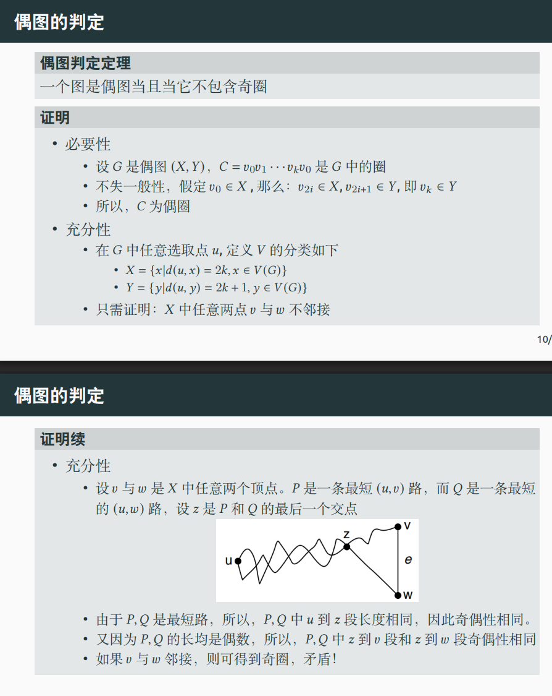

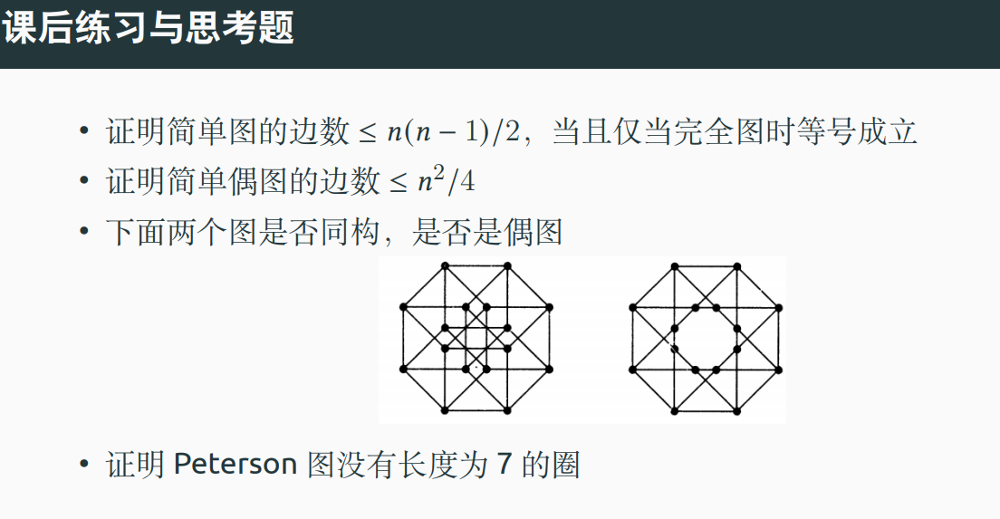

## 8、图的代数表示

邻接矩阵

判断是否连通

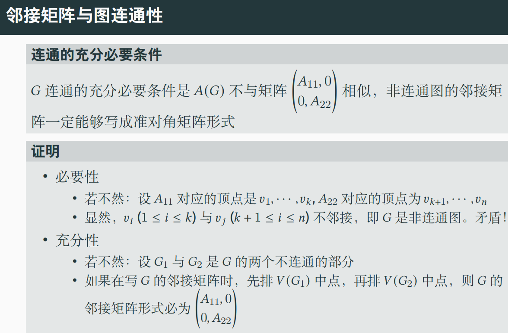

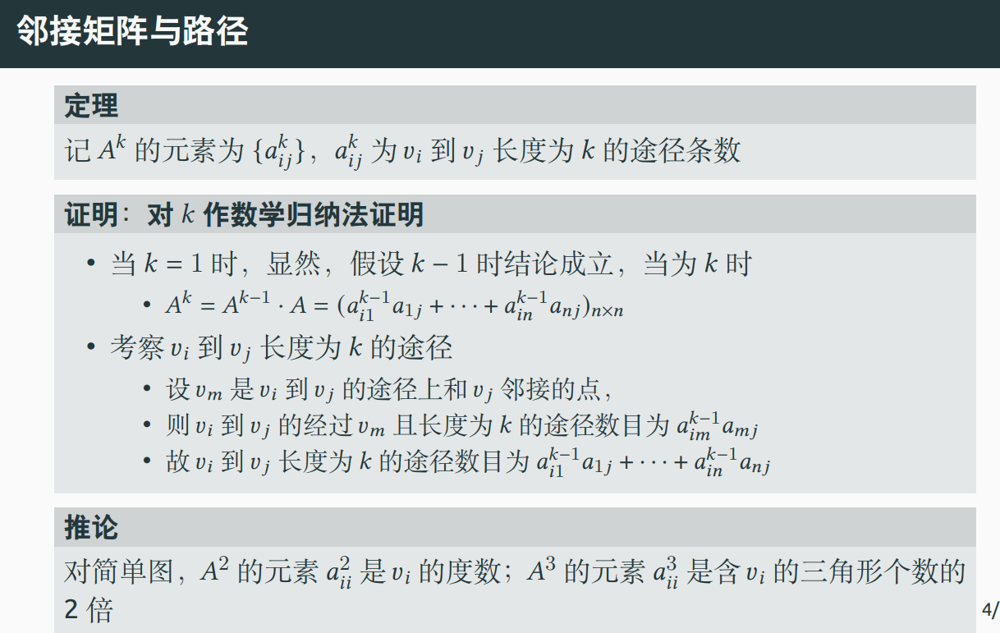

## （待巩固）9、最短路算法及其应用

### Dijkstra 的核心是：

for (int round = 0; round < n; round++) {
    int u = -1;

    for (int i = 0; i < n; i++) {
        if (!visited[i] && dist[i] < best) {
            u = i;
        }
    }

    visited[u] = true;

    for (int v = 0; v < n; v++) {
        dist[v] = min(dist[v], dist[u] + w[u][v]);
    }
}

它每次都选当前距离最小的点。

### Bellman-Ford 的核心是：

for (int round = 0; round < n; round++) {
    int u = -1;

    for (int i = 0; i < n; i++) {
        if (!visited[i] && dist[i] < best) {
            u = i;
        }
    }

    visited[u] = true;

    for (int v = 0; v < n; v++) {
        dist[v] = min(dist[v], dist[u] + w[u][v]);
    }
}

Dijkstra：每轮确定一个最近点。
Bellman-Ford：每轮把所有边都松弛一遍。

练习：

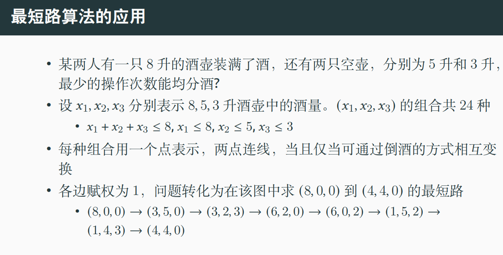

# 二、树

## 1、树的概念

无圈图

树，连通的无圈图

森林，无圈图

树与森林都是偶图

圈就是“首尾相接的路”，也叫 cycle：从某个顶点出发，沿边走一圈回到原顶点，并且中间顶点不重复。

每一颗非平凡树至少有两片树叶

图G是树当且仅当图G中任意两点都被唯一的路连接

若T是（m，n）树，则有m=n-1

具有k个分支的森林有n-k条边

每一个n阶连通图的边数至少为n-1

树是最小的连通图

任意树𝑇 两个不邻接顶点加一条边后，可得到唯一圈

G是树，如果G的最大度大于等于k，那么G至少有k个一度顶点

只要一组正整数可以排成度数序列，并且总和等于 2(n−1)，那么一定能画出一棵树，使得这棵树每个顶点的度数正好就是这组数

图的顶点的离心率：𝑒 (𝑣) = max{𝑑 (𝑢, 𝑣)|𝑢 ∈ 𝑉 }

图的半径：𝑟 = min{𝑒 (𝑣)|𝑣 ∈ 𝑉 }

图的中心点：离心率等于半径的点

图的中心：中心点的集合

树的中心由一个点或两个相邻点组成

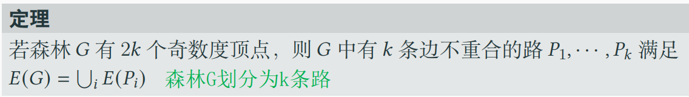

练习：

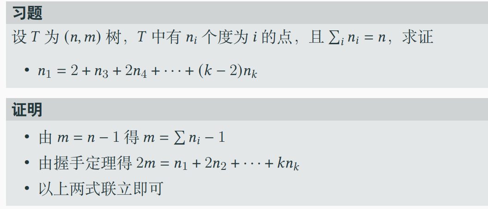

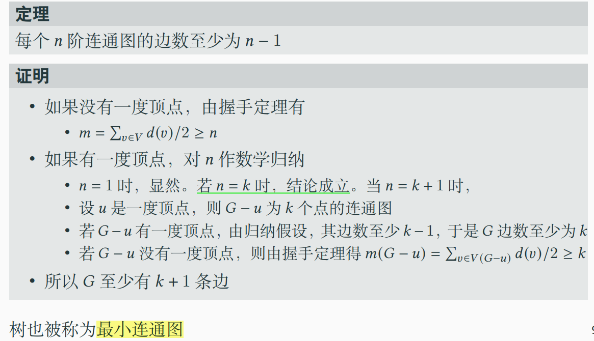

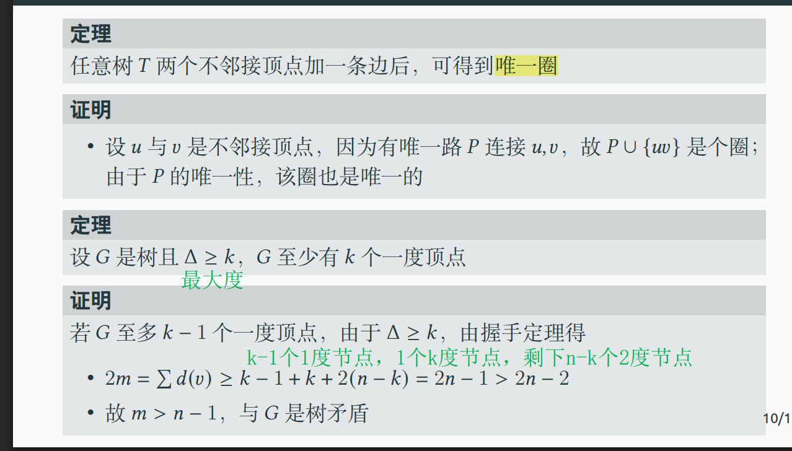

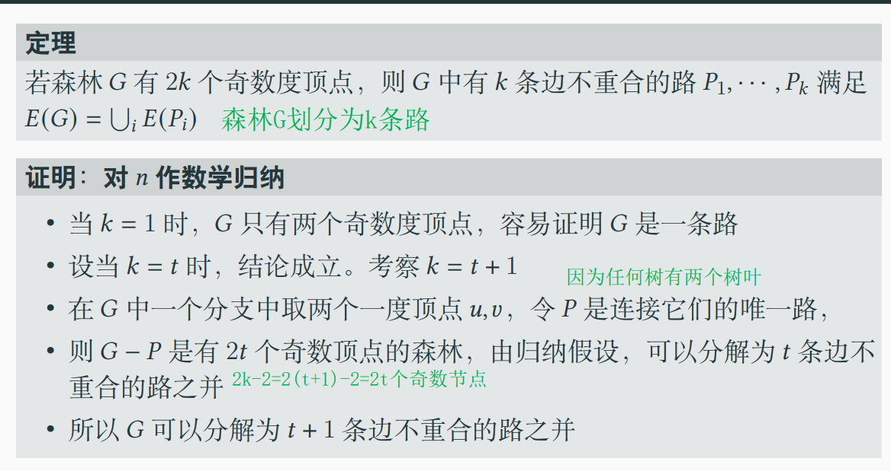

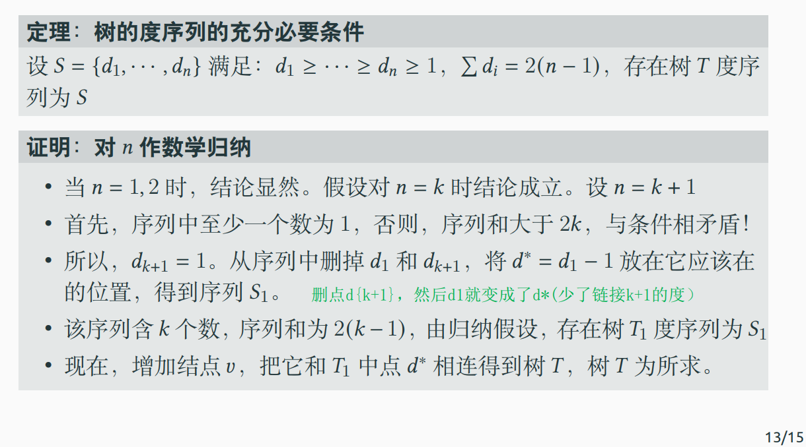

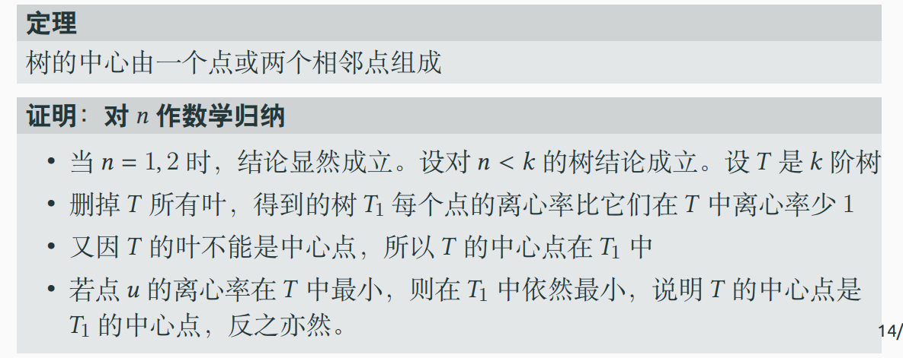

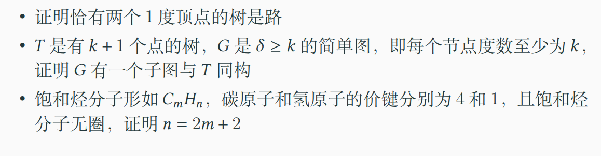
