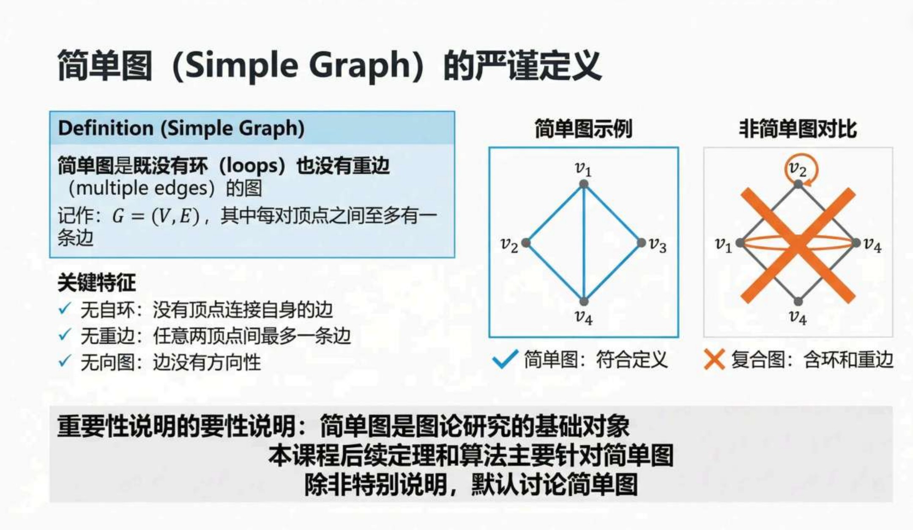
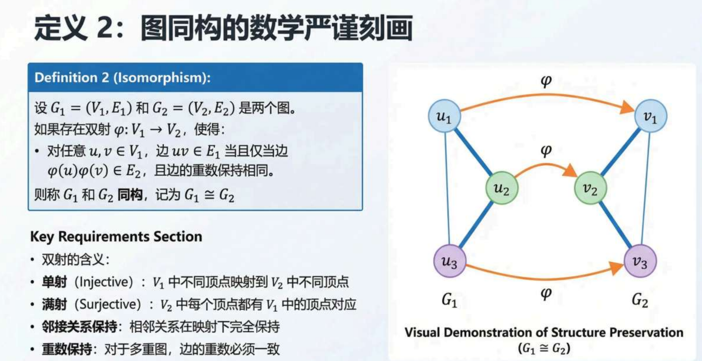
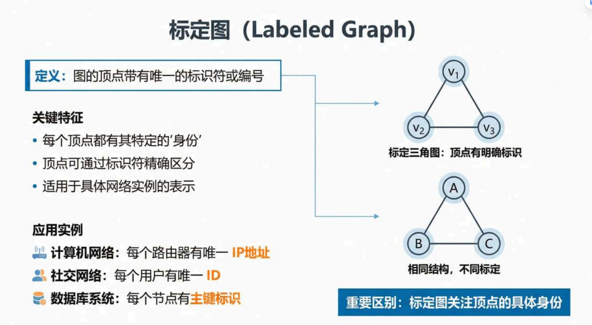
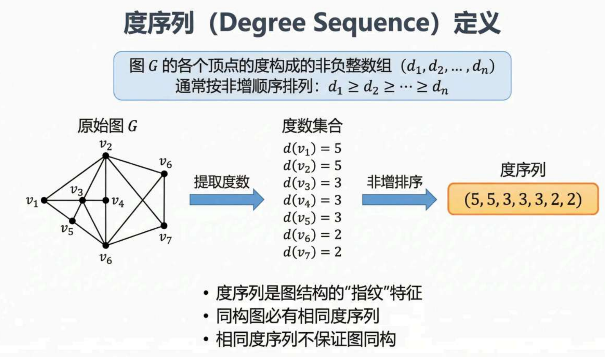
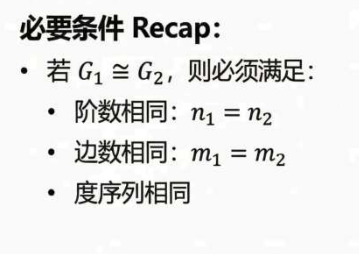
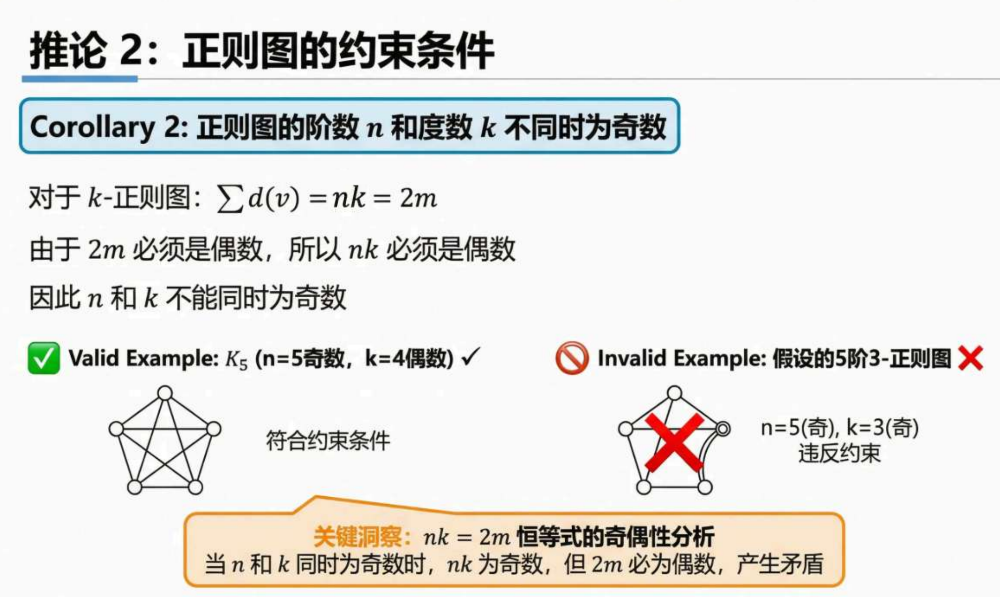
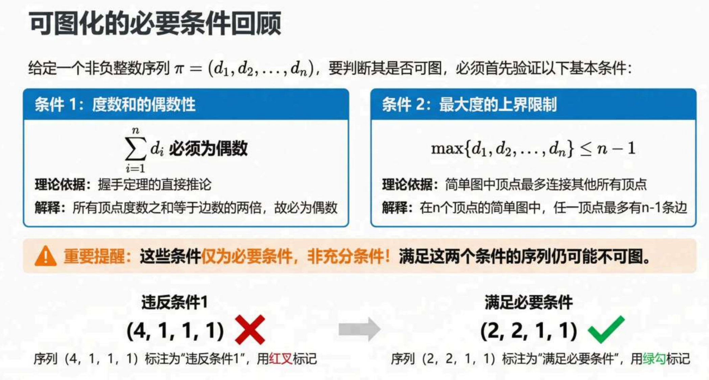
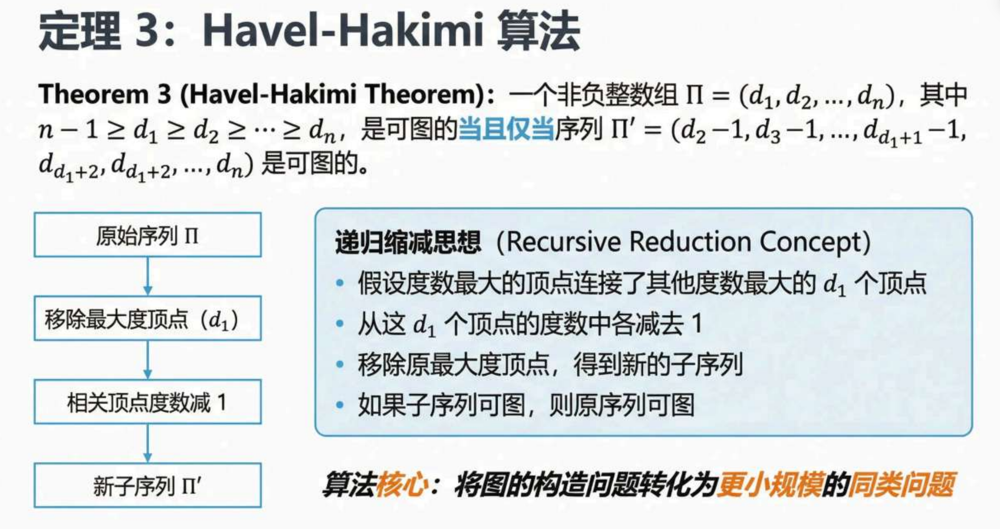
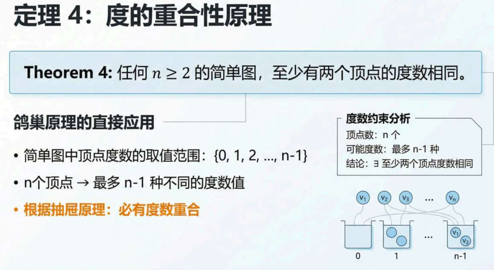

1.简单图定义：

2.一个图是偶图当且仅当它不包含长度为奇数的圈

3.图的边数和它的补图的边数相加等于它对应顶点数的完全图的边数

4.图同构

5.同构满足等价关系（对称性，自反性，传递性）

6.标定图

7.度序列 = 所有顶点的度组成的序列（通常按从大到小排列/非递增）

8.同构的必要条件

9.同构判定流程

10.握手定理

11.环在度数定义中会被计算两次

12.握手定理推论:

(1)一个图中，度数为奇数的点的个数必然为偶数个

应用:判定图的度序列能否存在（排除不可能的度序列）

(2)正则图的阶数n和度数k不能同时为奇数（分清楚完全图和正则图）

13.可图化判定

	

14.Havel-Hakimi算法（递归转化为更小规模的问题）

gpt

很多人第一次学 **Havel–Hakimi（HH）算法**都会卡住，我给你直接用**直觉 + 例子**讲清楚。

---

# 1 这句话在说什么

HH算法有一步是：

> 取最大度 d1d_1**d**1，然后让 **后面 d1d_1**d**1**** 个顶点的度各减1**

因为：

 **这个顶点需要连 d1d_1**d**1**** 条边** 。

所以它必须找 **d1d_1**d**1**** 个不同顶点**连接。

---

# 2 “超过序列剩余长度”是什么意思

假设你有序列：

<pre class="overflow-visible! px-0!" data-start="229" data-end="246">

(4,1,1,1)

</pre>

步骤：

### 第一步

最大度

<pre class="overflow-visible! px-0!" data-start="267" data-end="281">

d1 = 4

</pre>

删除它：

<pre class="overflow-visible! px-0!" data-start="289" data-end="304">

(1,1,1)

</pre>

现在只剩 **3个顶点**

但是这个顶点需要：

<pre class="overflow-visible! px-0!" data-start="332" data-end="344">

4 条边

</pre>

问题来了：

<pre class="overflow-visible! px-0!" data-start="353" data-end="373">

只剩3个顶点 却要连4个

</pre>

这是  **不可能的** 。

因为简单图里：

* 一个顶点 **最多只能和其他顶点各连一次**
* 不能自己连自己
* 不能重复连

所以：

<pre class="overflow-visible! px-0!" data-start="447" data-end="471">

需要连接4个顶点 但只有3个顶点

</pre>

这就是：

> 需要减少的元素数量 **超过序列剩余长度**

因此：

<pre class="overflow-visible! px-0!" data-start="510" data-end="527">

(4,1,1,1)

</pre>

 **不是图形序列** 。

---

# 3 再看一个更明显的例子

<pre class="overflow-visible! px-0!" data-start="563" data-end="580">

(5,2,2,2)

</pre>

删除5：

<pre class="overflow-visible! px-0!" data-start="588" data-end="603">

(2,2,2)

</pre>

需要减：

<pre class="overflow-visible! px-0!" data-start="611" data-end="623">

5个元素

</pre>

但只剩：

<pre class="overflow-visible! px-0!" data-start="631" data-end="643">

3个元素

</pre>

直接判定：

**不可能存在这种图。**

---

# 4 为什么图论里一定不行

如果一个顶点度是 **5**

意味着：

<pre class="overflow-visible! px-0!" data-start="710" data-end="726">

它必须连接5条边

</pre>

但图只有：

<pre class="overflow-visible! px-0!" data-start="735" data-end="747">

4个顶点

</pre>

它最多只能连：

<pre class="overflow-visible! px-0!" data-start="758" data-end="769">

3条边

</pre>

（连接其他三个顶点）

所以不可能。

---

# 5 一句话总结

这句话其实就是在检查：

> **最大度是否大于剩余顶点数**

如果

d1>n−1d_1 > n-1**d**1>**n**−**1**
那一定  **不是图形序列** 。

因为一个顶点最多连接  **n−1 个顶点** 。

15.度的重合性定理

n>=2的简单图，至少有两个顶点的度数相同

理解：简单图n个顶点

度数的取值范围是 **$\{0, 1, 2, \dots, n-1\}$**

但是这里有一个前提就是n-1和0不可能同时存在，因为n-1就代表它连接了所有的点

因此最多有n-1种度数的分布，而总个数n因此必然有重复

