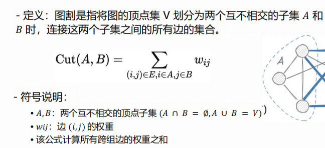
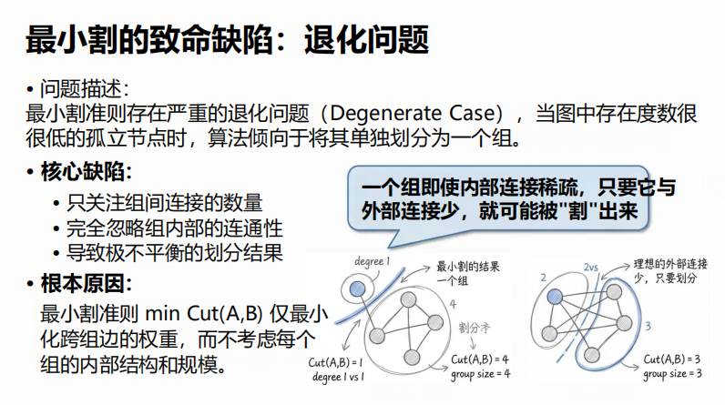
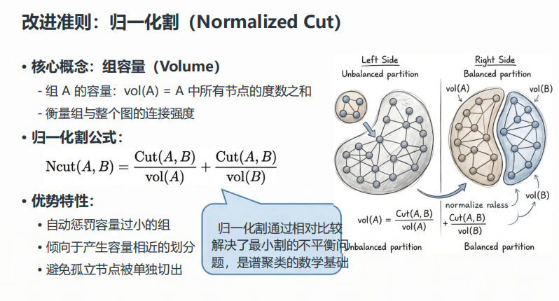
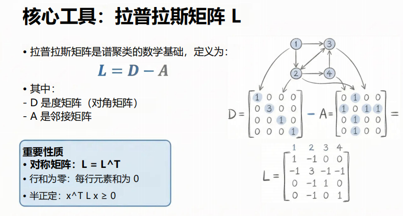
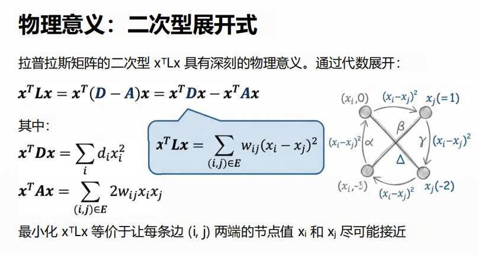
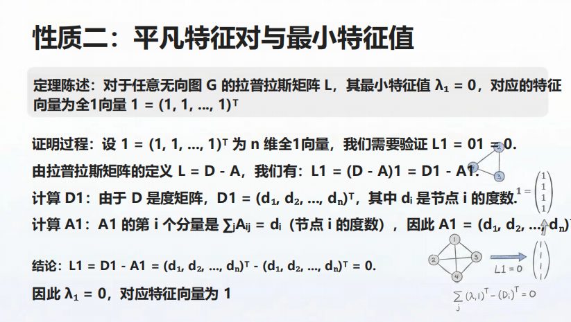
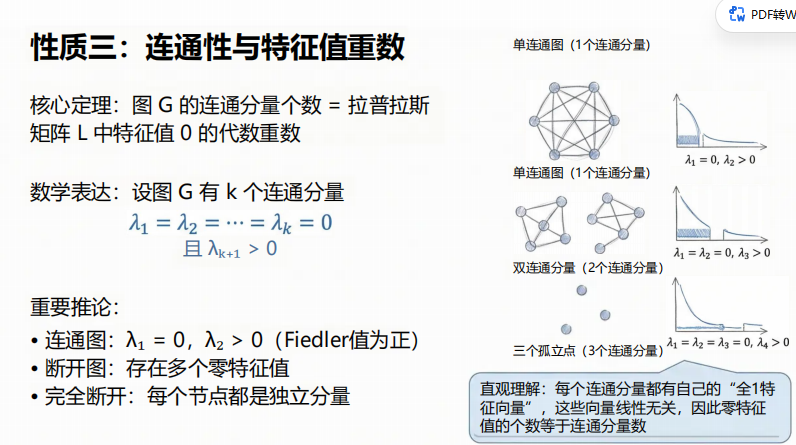

# 谱聚类与图划分

# 什么是好的图划分

## 核心目标

最大化组内连接：同一组节点之间连接紧密

最小化组间连接：不同组连接尽可能少

# 数学建模图割与优化目标

## 图割定义：

指的是将图的顶点集V划分为两个互不相交的子集A和B时，链接这两个子集之间的所有边的集合，注意是权值

## 最小割

最小化组间链接的总权重

直观理解就是割掉两个组的边，是的组间联系最少

## 最小割缺陷：退化问题

因为它只关注组间，不关注组内部的连通性

## 改进准则：归一化割

# 拉普拉斯矩阵与谱松弛

### 特征：

#### ① 行和为零：每行元素和为 0

这是因为 **$L = D - A$**。**$D$** 的对角线是度数，**$A$** 的每一行是邻居。

* **直观理解** ：这代表一种**“平衡”**。如果你把每个顶点的数值看作温度，拉普拉斯矩阵描述的是温度如何在节点间扩散。如果没有外部热源，内部流动的总和应该是平衡的。

#### ② 半正定性：**$x^T L x \ge 0$**

这个公式在物理学和机器学习里非常重要。

* **数学本质** ：**$x^T L x = \sum_{(i,j) \in E} (x_i - x_j)^2$**。
* **直观理解** ：它衡量了向量 **$x$** 在图上的**“平滑度”**。如果相邻顶点的 **$x$** 值很接近（**$x_i \approx x_j$**），那么这个值就很小。在谱聚类里，我们会寻找让这个值最小的 **$x$**，因为这代表了图的最佳划分方案。

#### ③ 最小特征值永远为 0

任何拉普拉斯矩阵都有一个特征值为 **$0$**，对应的特征向量是全 1 向量 **$\mathbf{1}$**。

* **物理意义** ：全 1 向量代表图上的信号是“平滑”的（所有点值都一样），此时没有任何能量流动。
* **聚类意义** ：我们不看第 1 小的特征值（它是 0），我们看 **第 2 小的特征值** 。它的大小代表了图的连通强度（也叫 Fiedler 值）。

## 物理意义：二次展开式

**带权图（Weighted Graph） **中，顶点的“度”就不再是简单地数一数有几条边了，而是演变成了** “边权重的累加”** 。

## 如何理解x

**在“做题”或“跑算法”之前，**$x$** 是没有具体值的，它是一个“待定变量”。**

为了让你彻底理解，我们可以分两个层面来看：

---

### 1. **$x$** 是什么？（物理意义）

你可以把 **$x$** 想象成给图中的每个节点 **贴一个标签** （或者打一个分）。

* 如果图有 **$n$** 个节点，**$x$** 就是一个 **$n$** 维向量：**$x = [x_1, x_2, \dots, x_n]^T$**。
* **$x_i$ 就是第 **$i$** 个节点身上的“数值”** 。

---

### 2. **$x$** 的值是怎么来的？（三个场景）

#### 场景 A：**$x$** 是“已知量”（计算能量）

假设你已经给每个点打好分了（比如：**$x_a=1, x_b=1, x_c=-1, x_d=-1$**）。

* 这时，**$x$** 有了 **具体值** 。
* 你把这些值代入 **$x^T Lx$**，算出来一个数（比如 **$8$**）。这个数告诉你：在你这种打分下，图的“不和谐程度”是 **$8$**。
* **用途** ：衡量当前状态的平滑度。

#### 场景 B：**$x$** 是“待求量”（寻找最优切法）—— **这是谱聚类的核心**

你想把图分成两类，但不知道怎么分。

* 此时 **$x$**  **没有具体值** 。
* 你告诉数学工具：“请帮我找到一组 **$x$**，使得 **$x^T Lx$** 最小（且满足一些限制条件）。”
* **结果** ：通过计算 **$L$** 的 **特征值和特征向量** ，数学工具会吐出一组 **具体的 **$x$** 值** 。
* **怎么用** ：你会发现，算出来的 **$x_i$** 结果里，互相连接紧密的点，数值会自动变得非常接近。你根据这些具体的 **$x$** 值（比如正数归一类，负数归一类），就完成了自动聚类。

#### 场景 C：**$x$** 是“输入特征”（图卷积 GNN）

如果你在做深度学习。

* **具体值** ：**$x$** 的值就是你收集到的原始数据。比如 **$x_i$** 是第 **$i$** 个用户的年龄。
* **用途** ：把这个具体的 **$x$** 乘以 **$L$**，得到的结果代表了“这个特征在空间上的变化率”。

---

### 3. 举个最简单的“具体”例子

假设有一个只有两个点的图：**$1 - 2$**，边权 **$w_{12} = 1$**。

它的拉普拉斯矩阵是：

$$
L = \begin{pmatrix} 1 & -1 \\ -1 & 1 \end{pmatrix}
$$

如果你随机给 **$x$** 赋两个具体值，比如 **$x_1 = 5, x_2 = 3$**：

那么 **$x^T Lx = (x_1 - x_2)^2 = (5 - 3)^2 = 4$**。

如果你让两点分数一样，比如 **$x_1 = 4, x_2 = 4$**：

那么 **$x^T Lx = (4 - 4)^2 = 0$**。（这是能量最低的状态，最和谐）。

---

### 总结

* **平时看公式时** ：把 **$x$** 看作是节点的“属性值”或“坐标”。
* **做算法时** ：**$x$** 是我们要求解的 **目标** 。我们通过最小化二次型，强迫 **$x$** 变成那种“能反映图结构”的具体数值。

## 理解这个公式的推导

本质上是在做一场**“计数游戏”**：我们要证明把矩阵 **$L$** 拆开算的结果，和把每一条边单独拿出来算的平方和是一回事。

假设我们有一个无向带权图，拉普拉斯矩阵定义为 **$L = D - A$**。我们要推导：

$$
x^T Lx = \frac{1}{2} \sum_{i=1}^n \sum_{j=1}^n w_{ij}(x_i - x_j)^2
$$

---

### 第一步：利用矩阵的线性性质拆分

根据 **$L = D - A$**，我们可以把二次型拆成两部分：

$$
x^T Lx = x^T (D - A) x = x^T Dx - x^T Ax
$$

### 第二步：展开第一项 **$x^T Dx$**（度矩阵部分）

由于 **$D$** 是对角矩阵，只有对角线上的 **$D_{ii}$**（即顶点 **$i$** 的度 **$d_i$**）非零。

$$
x^T Dx = \sum_{i=1}^n d_i x_i^2
$$

在带权图中，度数 **$d_i = \sum_{j=1}^n w_{ij}$**，代入进去：

$$
x^T Dx = \sum_{i=1}^n \left( \sum_{j=1}^n w_{ij} \right) x_i^2 = \sum_{i,j} w_{ij} x_i^2
$$

### 第三步：展开第二项 **$x^T Ax$**（邻接矩阵部分）

根据矩阵乘法的定义，**$x^T Ax$** 实际上是所有元素的加权组合：

$$
x^T Ax = \sum_{i=1}^n \sum_{j=1}^n w_{ij} x_i x_j
$$

### 第四步：合并与“凑平方”

现在我们将两部分合并在一起：

$$
x^T Lx = \sum_{i,j} w_{ij} x_i^2 - \sum_{i,j} w_{ij} x_i x_j
$$

为了利用完全平方公式 **$(x_i - x_j)^2 = x_i^2 + x_j^2 - 2x_i x_j$**，我们需要对公式做一点技巧性的变形。注意 **$w_{ij} = w_{ji}$**（无向图）：

1. 我们可以把 **$\sum w_{ij} x_i^2$** 拆成两半，写成 **$\frac{1}{2} \sum w_{ij} x_i^2 + \frac{1}{2} \sum w_{ji} x_j^2$**。
2. 同理，**$- \sum w_{ij} x_i x_j$** 可以写成 **$- \frac{1}{2} \sum 2 w_{ij} x_i x_j$**。

全部放进一个大求和号里：

$$
x^T Lx = \frac{1}{2} \sum_{i,j} w_{ij} \left( x_i^2 + x_j^2 - 2x_i x_j \right)
$$

### 最后结果

利用 **$(x_i - x_j)^2$**，我们得到了：

$$
x^T Lx = \frac{1}{2} \sum_{i,j} w_{ij} (x_i - x_j)^2
$$

---

### 为什么公式里有一个 **$\frac{1}{2}$**？

你会发现你图片里的蓝色框里没有 **$\frac{1}{2}$**，那是由于求和范围的定义不同：

* **如果你是对“所有边” **$(i,j) \in E$** 求和** ：每条边只算一次，就没有 **$\frac{1}{2}$**。
* **如果你是对“所有矩阵元素” **$i,j$** 遍历** ：每条边会被算两次（**$i \to j$** 一次，**$j \to i$** 一次），所以前面要补一个 **$\frac{1}{2}$** 来抵消。

### 总结

这个推导告诉我们： **$L$ 矩阵的结构巧妙地利用了度数（平方项）和邻接关系（交叉项），严丝合缝地构造出了“差值的平方”** 。

这正是拉普拉斯矩阵的魅力：它用最简单的线性代数形式（矩阵减法），捕捉了非线性的几何特征（点对点的距离）。

## 半正定性

大于等于0

## 公式含义

我们把这个复杂的矩阵乘法 **$x^T Lx$** 展开后得到的 **$\sum w_{ij}(x_i - x_j)^2$**，可以从以下三个层面来拆解它的深层含义：

---

### 1. 衡量“信号”的平滑度（最直观的含义）

想象图里的每个节点 **$i$** 都有一个值 **$x_i$**。

* **如果 **$x^T Lx$** 的值很小** ：说明在图中所有 **连着的点** ，它们的分数 **$x_i$** 和 **$x_j$** 都很接近。这代表这个信号在图上分布得非常 **平滑** 。
* **如果 **$x^T Lx$** 的值很大** ：说明有很多连着的点，它们的分数差得特别远。这代表信号在图上跳变剧烈，非常 **违和** 。

---

### 2. 衡量“分类”的代价（聚类的含义）

在你学习的 **谱聚类** （Spectral Clustering）中，这个公式的含义就变成了 **切断边的成本** ：

* 假设你想把图分成两拨人：一拨给 **$x_i = 1$**（代表 A 类），另一拨给 **$x_j = -1$**（代表 B 类）。
* 看公式 **$\sum w_{ij}(x_i - x_j)^2$**：
  * 如果 **$i$** 和 **$j$** 是同一类，那么 **$(1 - 1)^2 = 0$**，对公式 **没有贡献** 。
  * 如果 **$i$** 和 **$j$** 连着但被你分到了不同类，那么 **$(1 - (-1))^2 = 4$**，公式就会 **记上一笔很大的惩罚** 。
* **含义** ：**$x^T Lx$** 实际上是在统计你这一刀切下去， **切断了多少权重大的边** 。最小化这个公式，就是为了让“好哥们”（权重大的边）尽量留在同一个类里。

---

### 3. 物理意义：系统的总势能

如果你把节点想象成小球，边想象成弹簧：

* **$(x_i - x_j)^2$** 就像是弹簧被拉伸后的 **弹性势能** 。
* **$w_{ij}$** 是弹簧的 **劲度系数** （越粗的边，弹簧越硬）。
* **$x^T Lx$ 的含义就是整个系统的总能量。**

一个稳定的物理系统总是倾向于处于**能量最低**的状态。所以，当我们求拉普拉斯矩阵的特征向量时，其实是在找一种“最自然、最省力”的节点排布方式。

---

### 总结

这个公式存在的唯一目的，就是 **把“图的拓扑结构”转化为“点的数值差异”** 。

* **$L$ 矩阵** ：是图的骨架（结构）。
* **$x$ 向量** ：是你在骨架上填的肉（数值）。
* **$x^T Lx$** ：是肉在骨架上长得“顺不顺”的一个总分。

**举个极端的例子：**

如果一个图是不连通的（分成了两块），那么一定存在一个不全为 0 的 **$x$**，使得 **$x^T Lx = 0$**。

**这意味着什么？** 这意味着你可以给其中一块全打 1 分，另一块全打 0 分。因为两块之间没有边相连，所以没有任何 **$(x_i - x_j)^2$** 项会产生贡献。这个“0 能量”状态完美地反映了图的物理断裂。

## 性质：平凡特征对与最小特征值

就是说求Ax=$\lambda$x的时候，肯定有一个值$\lambda$=0，因为L=D-A嘛

## 性质：连通性与特征重数

特征值重数即为连通分量个数

# 算法实现与总结谱聚类算法流程及应用

## 谱聚类理论基础补充：从图割到谱松弛

谱聚类算法的核心思想是：将图割（Graph Cut）这一离散优化问题，通过拉普拉斯谱松弛（Spectral Relaxation）转化为矩阵特征值问题，从而把难解的组合优化问题变成可解的连续优化问题。

### 1. 从图割问题出发

设图 $G=(V,E)$，将顶点集合二分为 $V=A\cup B$，其割代价定义为：

$$
\mathrm{cut}(A,B)=\sum_{i\in A,\,j\in B} w_{ij}
$$

引入指示向量 $x\in\mathbb{R}^n$：

$$
x_i=
\begin{cases}
1, & i\in A \\
-1, & i\in B
\end{cases}
$$

可证明割代价与拉普拉斯二次型满足：

$$
x^T L x=\frac{1}{2}\sum_{i,j} w_{ij}(x_i-x_j)^2
$$

该式说明：

1. 若两个顶点在同一集合，则 $(x_i-x_j)^2=0$，无惩罚。
2. 若两个顶点在不同集合，则产生正惩罚，且边权越大惩罚越大。

因此，在离散约束 $x_i\in\{1,-1\}$ 下最小化 $x^T Lx$，与最小割目标一致。

### 2. 谱松弛：离散问题连续化

原问题是组合优化，直接求解困难。谱方法将离散约束放宽为连续约束，令 $x\in\mathbb{R}^n$，并加入规范化条件：

$$
x^T\mathbf{1}=0,\quad x^Tx=1
$$

于是得到优化问题：

$$
\min_{x\perp \mathbf{1},\,\|x\|=1} x^TLx
$$

这是标准 Rayleigh 商最小化问题，其最优解为拉普拉斯矩阵第二小特征值对应的特征向量。

### 3. 为什么特征向量能反映聚类结构

核心原因是拉普拉斯二次型刻画了图信号平滑性：

$$
x^T L x=\frac{1}{2}\sum_{i,j} w_{ij}(x_i-x_j)^2
$$

当边权 $w_{ij}$ 大时，优化倾向于让 $x_i$ 与 $x_j$ 更接近；当连接弱时，允许差异更大。于是同簇节点在特征向量中取值接近，不同簇节点取值分离，形成天然可分结构。

### 4. Fiedler 值与 Fiedler 向量

拉普拉斯第二小特征值 $\lambda_2$ 称为 Fiedler 值（代数连通度），其意义包括：

1. 连通性度量：$\lambda_2>0$ 当且仅当图连通；$\lambda_2$ 越小，图越接近被分裂成两部分。
2. 物理意义：把图看作弹簧质点系统，$x^TLx$ 是势能，$\lambda_2$ 对应去除平移自由度后的最小振动能量，表示最易发生的“断裂模式”。
3. 几何意义：Fiedler 向量给出图到一维实数轴的最优嵌入方向，是图上的最平滑非平凡函数。

### 5. 利用 Fiedler 向量进行二分

在图二分中，可用 Fiedler 向量分量 $x_i$ 划分节点：

1. 按符号划分：$x_i\ge 0$ 与 $x_i<0$ 分为两类。
2. 按排序阈值划分：对 $x_i$ 排序后选取最优阈值进行切分。

该方法能在近似意义下最小化图割代价，并兼顾划分平衡性。

### 6. 小结

谱聚类通过拉普拉斯谱松弛，将离散图结构转为连续几何结构，再利用特征向量表达节点相似关系，从而实现对聚类结构的有效近似。其中：

1. Fiedler 值刻画整体连通强弱。
2. Fiedler 向量给出最优二分方向。

这就是谱聚类“可算、可解释、可落地”的理论基础。

### 7. 直观理解补充：这个优化到底在做什么

先看核心式子：

$$
x^TLx=\frac{1}{2}\sum_{i,j}w_{ij}(x_i-x_j)^2
$$

其中每一项的含义是：

1. 如果 $i,j$ 之间有强连接（$w_{ij}$ 大），那么 $x_i$ 和 $x_j$ 差得越多，惩罚越大。
2. 所以最小化这个式子，本质上是在让“有边连接的点取相似值”。

这就是第一层结论：

优化该目标，会倾向于让相邻节点数值接近。

#### (1) 为什么说“尽量相同”

如果没有任何额外约束，最优解会退化为常数向量：

$$
x_1=x_2=\cdots=x_n
$$

此时对任意边都有 $(x_i-x_j)^2=0$，于是：

$$
x^TLx=0
$$

虽然这是最小值，但它不包含任何分组信息。

#### (2) 为什么必须加约束

为避免退化，需要加入：

$$
x^T\mathbf{1}=0,\quad \|x\|=1
$$

其作用分别是：

1. $x^T\mathbf{1}=0$：限制向量与常数方向正交，不允许全部取同一个值。
2. $\|x\|=1$：固定尺度，防止零向量等无意义解。

于是优化变成：

在“不能全一样”的前提下，让相邻点尽量接近。

#### (3) 为什么会自然出现“分组结构”

考虑两团结构：

1. A 组内部连接密。
2. B 组内部连接密。
3. A 与 B 之间连接稀疏。

优化后常见现象是：

1. A 组节点取值接近（如 $-1,-0.9,-0.8$）。
2. B 组节点取值接近（如 $0.8,0.9,1$）。

原因很直接：

1. 组内边多，若数值差大，惩罚很大，所以组内会被“拉平”。
2. 组间边少，允许一定差异，因此两组可被“拉开”。

这就是第二层结论：

优化会自动把图拉成几块，簇内接近、簇间分离。

#### (4) 一句话总结这组约束优化

该问题可以概括为：

在“必须有差异”的前提下，让差异尽量只发生在连接弱的位置。

这正是聚类边界出现的地方。

#### (5) 弹簧系统类比（强烈建议记住）

把图看成点和弹簧系统：

1. 节点是质点。
2. 边权 $w_{ij}$ 是弹簧刚度。
3. $x^TLx$ 是系统势能。

当系统在约束下寻找最低能量状态时：

1. 连得紧的点会聚在一起。
2. 连得松的区域更容易被拉开。

被拉开的“缝”就是聚类边界。

因此，谱聚类、拉普拉斯算子的物理意义，以及很多图学习方法（包括 GNN 中的平滑思想）在这一点上是统一的。
