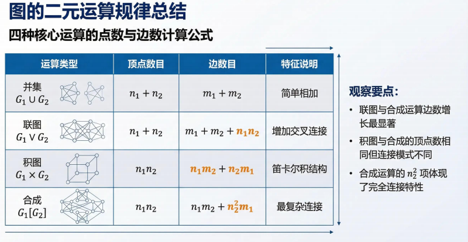
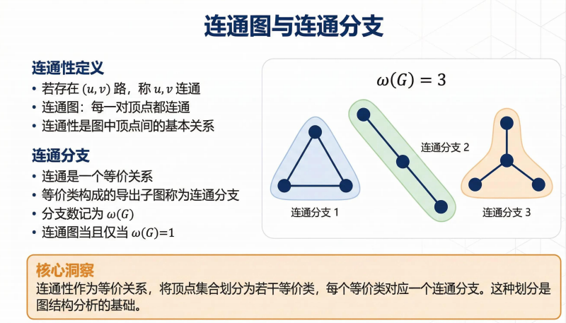
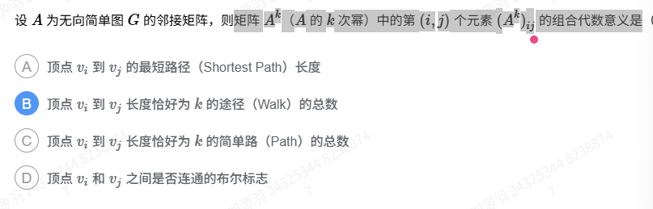
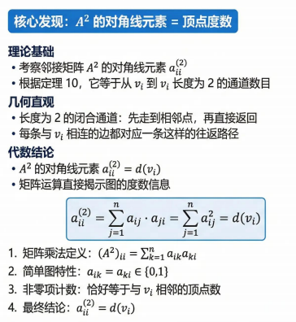
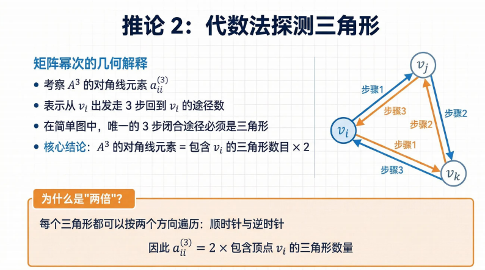

# 1.子图定义：


# 2.图运算：

2.1对称差运算

2.2联运算（感觉像二分图）


2.3积运算（难点）：笛卡尔积，未理解，待定，可借例子理解


理解积运算（Graph Product）最直观的方法，是把它想象成一种**“图的维度扩张”**。

如果觉得公式太抽象，我们可以用**“平移” **、** “坐标” **和** “嵌套循环”**这三个视角来拆解它。

---

### 1. 视角一：平移运动（“分身术”）

想象你有两个图：图 **$G$**（一条线段）和图 **$H$**（一个三角形）。

* **第一步** ：把图 **$H$** 看作一个整体。
* **第二步** ：按照图 **$G$** 的样子，把图 **$H$** 复刻出两份。
* **第三步** ：在两份 **$H$** 的对应顶点之间连上线。

这就好比你拿着一个三角形的“模具”，沿着一条线段的轨迹 **平移** 。平移扫过的路径所形成的框架，就是积运算的结果。

* **点积点** **$\rightarrow$** 变成点。
* **线积线** **$\rightarrow$** 变成面（网格）。
* **面积线** **$\rightarrow$** 变成体（柱体）。

### 2. 视角二：程序员的“嵌套循环”

作为 CS 专业的学生，你可以把积运算看作是一次 `nested loop`。

假设有两个顶点集合 **$V_G$** 和 **$V_H$**。新图的每一个顶点就是一个坐标 **$(i, j)$**。

**Python**

```
# 伪代码：构造积运算的顶点和边
for u in G.nodes:
    for v in H.nodes:
        new_graph.add_node((u, v))

# 边的规则：每次只许变一个变量
# 如果 u1-u2 有边，那么 (u1, v) 和 (u2, v) 连边
# 如果 v1-v2 有边，那么 (u, v1) 和 (u, v2) 连边
```

这就像是在玩 **棋盘游戏** ：

* 图 **$G$** 决定了你在“横轴”上怎么走。
* 图 **$H$** 决定了你在“纵轴”上怎么走。
* **笛卡尔积**的规则是：你每次只能**横着走一步**或者 **纵着走一步** ，不能斜着跳。

### 3. 视角三：超级立方体（Hypercube）

理解积运算最经典的例子就是 **超立方体 **$Q_n$**** 。

1. 从一个点开始（**$Q_0$**）。
2. **$Q_1 = Q_0 \square K_2$**：把点平移，得到一条线段。
3. **$Q_2 = Q_1 \square K_2$**：把线段平移，得到一个正方形。
4. **$Q_3 = Q_2 \square K_2$**：把正方形平移，得到一个立方体。
5. **$Q_4 = Q_3 \square K_2$**：把立方体向“第四维”平移，得到超立方体。

每一个更高维度的复杂图，其实都是由低维度的简单图通过“积”累加出来的。

---

### 总结一下

* **笛卡尔积 (**$G \square H$**)** ：像 **脚手架** 。你只能沿着现有的钢筋（边）横着或竖着爬。
* **强积 (**$G \boxtimes H$**)** ：像 **国王走位** 。你可以横走、竖走，还可以沿着对角线斜着走。
* **张量积 (**$G \times H$**)** ：像 **主教走位** 。你**必须**同时在横向和纵向都移动一步，只能走对角线。

这样理解会不会觉得“积运算”其实就是一个**自动生成高维框架**的工具？

您是在看哪类具体的题目？比如证明“两个偶图的积还是偶图”，还是在看关于“图的分解”的内容？


2.4合成运算

**把图 G**的每个顶点换成一整个图 H。

然后：

1. 每个顶点内部保持 **H 的结构**
2. 如果 G 中两个顶点相邻

   → 对应的两个 **H** **全部互连**

一句话：

> **用 H 替换 G 的每个顶点，并按照 G 的边在这些 H 之间建立完全连接**


n是点，m是边



# 3.图的连通性



图的直径：即图的两点之间最坏情况下的最短距离

# 4.偶图的判定

4.1证明：一个图是偶图当且仅当它不包含奇圈（偶图就是二分图，奇圈就是长度为奇数）


# 5、图的代数表示（从这里认真写）

## 邻接矩阵

矩阵乘法的几何意义：

矩阵 **A**k（**A** 的 **k** 次幂）中的第 **(**i**,**j**)** 个元素 **(**A**k**)**i**j 的组合代数意义是




矩阵幂运算=多步路径计数


理解“ **矩阵幂运算 = 多步路径计数** ”是图论中非常精妙的一个观察。我们可以通过**矩阵乘法的定义**和**中转站思想**来拆解它。

---

### 1. 核心直觉：寻找“中转站”

假设我们有一个邻接矩阵 **$A$**，其中 **$A_{ij}=1$** 表示从顶点 **$i$** 到 **$j$** 有一条直接的边（步长为 1）。

现在考虑 **$A^2$**，即 **$A \times A$**。根据矩阵乘法公式，结果矩阵中第 **$i$** 行第 **$j$** 列的元素为：

$$
(A^2)_{ij} = \sum_{r=1}^{n} A_{ir} \cdot A_{rj}
$$

这个求和公式在图论里有非常明确的物理意义：

* **$A_{ir}$** ：从 **$i$** 到中转点 **$r$** 有没有路？（1 是有，0 是无）
* **$A_{rj}$** ：从中转点 **$r$** 到终点 **$j$** 有没有路？
* **$A_{ir} \cdot A_{rj}$** ：只有当两条路 **同时存在** （**$1 \times 1 = 1$**）时，乘积才为 1。这意味着存在一条经过 **$r$** 的路径 **$i \to r \to j$**。
* **$\sum_{r=1}^{n}$** ：我们要遍历所有可能的中间节点 **$r$**。如果从 **$i$** 经过 **$r_1$** 能到 **$j$**，经过 **$r_2$** 也能到 **$j$**，那么加和的结果就是路径的总数。

**结论：**$(A^2)_{ij}$** 的数值，就是从 **$i$** 到 **$j$** 长度恰好为 2 的路径总数。**

---

### 2. 推广到 **$k$** 步：路径的延伸

通过数学归纳法可以理解 **$A^k$**：

$$
(A^k)_{ij} = (A^{k-1} \times A)_{ij} = \sum_{r=1}^{n} (A^{k-1})_{ir} \cdot A_{rj}
$$

这里的意思是：

1. 先看从 **$i$** 走 **$k-1$** 步能到达哪些中转点 **$r$**（对应的次数是 **$(A^{k-1})_{ir}$**）。
2. 再看这些中转点 **$r$** 能不能再走 1 步到达 **$j$**（对应的次数是 **$A_{rj}$**）。
3. 把所有可能的中转路径累加起来。

所以，**$A^k$ 的第 **$i$** 行第 **$j$** 列的数值，就是从 **$i$** 到 **$j$** 长度恰好为 **$k$** 的路径总数。**

---

### 3. 一个具体的例子

想象一个简单的三角形图 **$1 \to 2 \to 3 \to 1$**：

$$
A = \begin{pmatrix} 0 & 1 & 0 \\ 0 & 0 & 1 \\ 1 & 0 & 0 \end{pmatrix}
$$

* **算 **$A^2$**** ：

$$
$$(A^2) = \begin{pmatrix} 0 & 0 & 1 \\ 1 & 0 & 0 \\ 0 & 1 & 0 \end{pmatrix}
$$

  看第一行第三列 **$(A^2)_{13} = 1$**，这表示从 1 到 3 只有 1 条长度为 2 的路径（即 **$1 \to 2 \to 3$**）。

* **算 **$A^3$**** ：

$$
$$(A^3) = \begin{pmatrix} 1 & 0 & 0 \\ 0 & 1 & 0 \\ 0 & 0 & 1 \end{pmatrix} = I
$$

  看对角线 **$(A^3)_{11} = 1$**，表示从 1 出发走 3 步回到 1 的路径只有 1 条（即 **$1 \to 2 \to 3 \to 1$**）。

---

### 4. 延伸应用：连通性与可达矩阵

如果我们把矩阵中的数字运算换成  **布尔运算** （即 **$1+1=1$**），那么：

* **$A \vee A^2 \vee A^3 \dots \vee A^{n-1}$** 的结果就是 **可达矩阵** 。
* 只要对应的位置不是 0，就说明两点之间是连通的。

### 总结

理解这个问题的关键在于： **矩阵乘法本质上是在做穷举式的“中转匹配”** 。

* **乘法**代表路径的 **串联** （逻辑与）。
* **加法**代表路径的 **并联** （逻辑或，即统计有多少种选法）。

## 顶点度数的代数体现

理解：由顶点走到相邻的点，然后直接返回，所有路径的数量就等于顶点的度数

度矩阵：A平方只看对角线



## 代数法探测三角形

可以检测出三角形的数目，因为三角形是闭合的，所以一定会走向自己




## 关联矩阵
