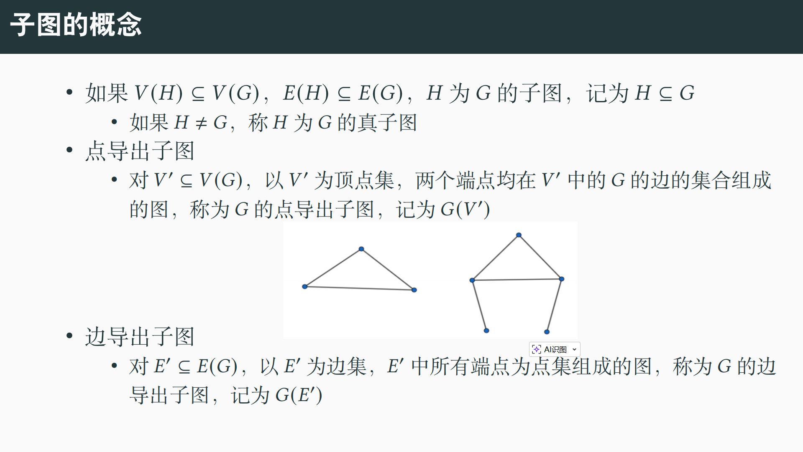
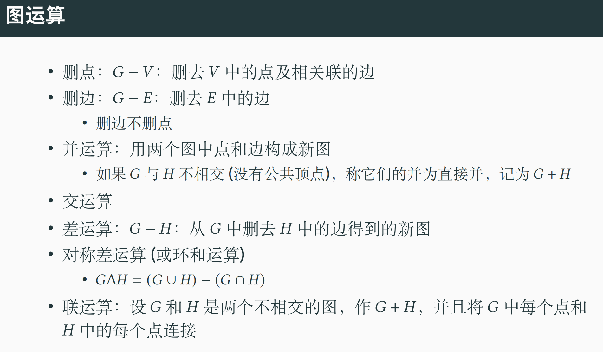
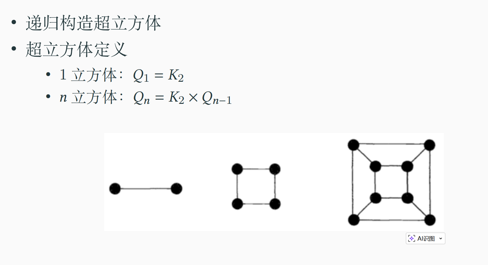
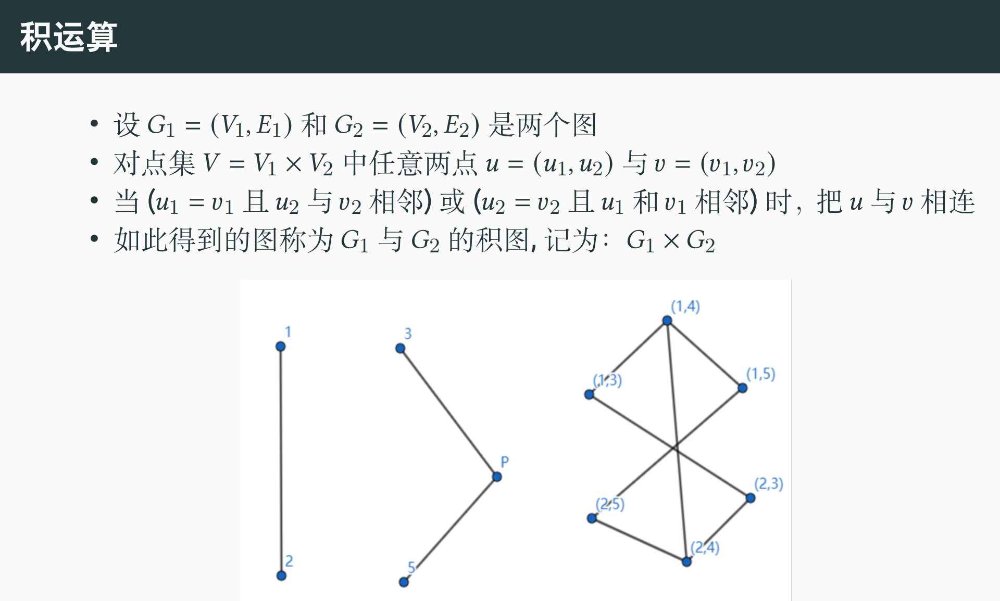
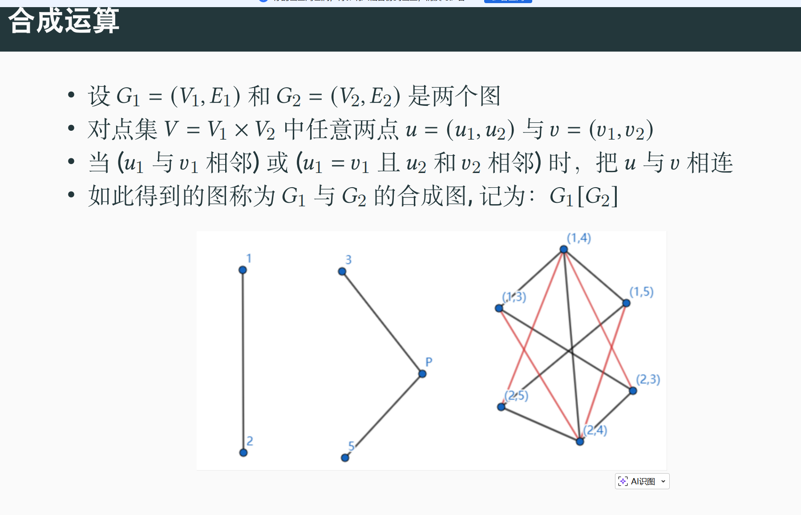
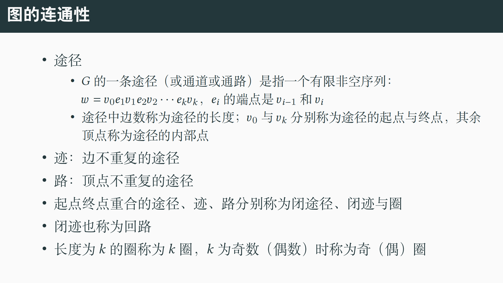

1.子图定义：

2.图运算：

2.1对称差运算

2.2联运算（感觉像二分图）

2.3积运算（难点）：笛卡尔积，未理解，待定，可借例子理解

2.4合成运算

**把图 G**的每个顶点换成一整个图 H。

然后：

1. 每个顶点内部保持 **H 的结构**
2. 如果 G 中两个顶点相邻

   → 对应的两个 **H** **全部互连**

一句话：

> **用 H 替换 G 的每个顶点，并按照 G 的边在这些 H 之间建立完全连接**
>

3.图的连通性

